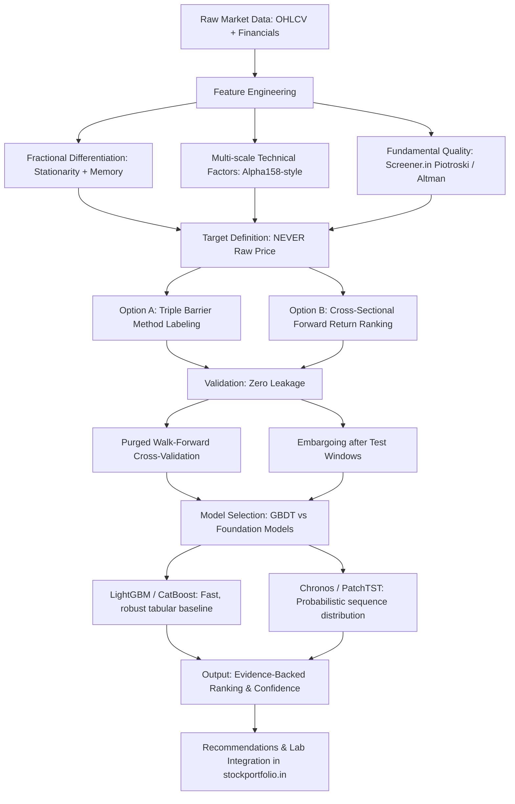

# Research & Architecture Plan: GitHub Stock Prediction Ecosystem & Quant ML Integration

This plan synthesizes deep research into top-starred, academic, and production-grade GitHub repositories for stock market prediction, financial time series forecasting, and AI-driven quantitative alpha generation. It analyzes what works, what fails, and how these paradigms can be cleanly adapted for **`stockportfolio.in`** without violating its core principles (zero invented data, evidence-backed scoring, read-only institutional execution).

---

## 1. Executive Summary: The State of "Stock Prediction" on GitHub

Researching "stock prediction" on GitHub reveals two radically different worlds:

1. **The Naive / Educational World (90% of Repositories)**:
   - **Pattern**: Download 5 years of daily Close prices via `yfinance`, normalize with `MinMaxScaler`, pass through a 2-layer LSTM or GRU, compute MSE loss against next day's price $P_{t+1}$.
   - **The Illusion**: High $R^2$ (0.95–0.99) and seemingly beautiful visual overlap on plots.
   - **The Reality (Lag Fallback)**: The model simply learns the trivial persistence baseline $\hat{P}_{t+1} \approx P_t$ (a 1-day delayed copycat). It has near-zero directional predictive power ($~50\%$) and produces negative returns once transaction friction, slippage, and STT are introduced.
   - **Lookahead Bias**: Normalizing features over the whole dataset before train/test splitting, and failing to account for stationarity or structural regime breaks.

2. **The Institutional & Advanced Quantitative World (Top Open-Source Frameworks)**:
   - **Problem Formulation Shift**: They **never** predict raw stock prices. Instead, they frame the task as:
     - **Cross-Sectional Relative Alpha / Ranking**: Ranking stocks in a universe (e.g., NIFTY 500) by expected forward return (Information Coefficient / Rank IC), as popularized by Microsoft `qlib`.
     - **Discrete State / Triple-Barrier Classification**: Predicting whether a stock hits a profit-take barrier, stop-loss barrier, or time expiration (Marcos López de Prado / `mlfinlab`).
     - **Volatility & Distributional Forecasting**: Predicting quantiles (10%, 50%, 90%), Value-at-Risk (VaR), or volatility surfaces rather than a deterministic single price point.
     - **Multi-Modal Decision Agents**: Blending technical factor tables with LLM sentiment extraction (FinGPT) and deterministic financial valuations (FinRobot).

---

## 2. Taxonomy of Top GitHub Stock Prediction Ecosystems

Below is a breakdown of the primary open-source projects across key categories:

### A. End-to-End Quantitative ML & Factor Mining Platforms

| Repository | Stars | Primary Architecture | Core Strength | Key Limitation |
|---|---|---|---|---|
| **[microsoft/qlib](https://github.com/microsoft/qlib)** | ~16k | LightGBM, DoubleEnsemble, ALSTM, Transformer, GATs, SFM | Institutional-grade pipeline; Alpha158/Alpha360 factor libraries; cross-sectional rank loss; rigorous backtesting | Heavy data preparation requirements; steep learning curve; default datasets geared towards China/US markets |
| **[AI4Finance-Foundation/FinRL](https://github.com/AI4Finance-Foundation/FinRL)** | ~11k | Deep Reinforcement Learning (PPO, SAC, DDPG, A2C, TD3) | Dynamic multi-asset portfolio rebalancing and trade execution as Markov Decision Processes | Sensitive to hyperparameter tuning; prone to overfitting on historical regimes |
| **[hudson-and-thames/mlfinlab](https://github.com/hudson-and-thames/mlfinlab)** (and community forks) | ~4.5k | Triple Barrier, Purged K-Fold CV, Fractional Differentiation | Faithfully implements Marcos López de Prado's *Advances in Financial Machine Learning*; prevents data leakage and spurious alpha | Computationally intensive; focuses on feature engineering and validation rather than turnkey models |

### B. Time-Series Foundation Models & Modern Transformers (2024–2026 SOTA)

| Repository | Stars | Primary Architecture | Core Strength | Key Limitation |
|---|---|---|---|---|
| **[shiyu-coder/Kronos](https://github.com/shiyu-coder/Kronos)** (AAAI 2026) | ~1.5k | Decoder-only autoregressive Transformer + specialized K-line tokenizer | Pre-trained specifically on 12B+ candlestick records across 45 global exchanges; understands OHLCV morphology natively | Heavy model checkpoints; directional prediction edge requires careful fine-tuning; experimental |
| **[amazon-science/chronos-forecasting](https://github.com/amazon-science/chronos-forecasting)** | ~5k | Pre-trained T5 language model adapted for tokenized continuous series | Zero-shot probabilistic forecasting with prediction intervals; no stock-specific training needed | Operates as a univariate sequence forecaster; does not natively ingest balance-sheet fundamentals or order-flow microstructure |
| **[thuml/iTransformer](https://github.com/thuml/iTransformer)** & **[yuqinie98/PatchTST](https://github.com/yuqinie98/PatchTST)** | ~4k+ | Inverted Transformers (series-as-tokens) & Patching with Channel-Independence | Overcomes traditional transformer degradation on long financial lookbacks; SOTA benchmark on multivariate series | Requires bespoke pipeline for tabular feature integration and backtesting |

### C. Financial LLMs & Multi-Agent Intelligence

| Repository | Stars | Primary Architecture | Core Strength | Key Limitation |
|---|---|---|---|---|
| **[AI4Finance-Foundation/FinGPT](https://github.com/AI4Finance-Foundation/FinGPT)** | ~15k | LoRA / QLoRA fine-tuned open LLMs (LLaMA 3, Mistral) on financial text | Financial sentiment analysis, news event extraction, and filing impact evaluation | Requires GPU infrastructure for local fine-tuning; inference latency for real-time screens |
| **[AI4Finance-Foundation/FinRobot](https://github.com/AI4Finance-Foundation/FinRobot)** | ~3k | Multi-agent Chain-of-Thought with deterministic math layer | Strictly separates deterministic financial calculations (DCF, Greeks) from LLM narrative synthesis | Focuses on equity research reporting rather than continuous statistical price prediction |
| **[The-FinAI/PIXIU](https://github.com/The-FinAI/PIXIU)** | ~2k | Financial LLM instruction datasets & FLARE/FinBen benchmarks | Curated fine-tuning datasets and standardized evaluation for stock price movement from disclosures | Evaluation framework rather than a live trading engine |

### D. Classic Deep Learning & Hybrid Approaches

| Repository | Stars | Primary Architecture | Core Strength | Key Limitation |
|---|---|---|---|---|
| **[borisbanushev/stockpredictionai](https://github.com/borisbanushev/stockpredictionai)** | ~7.5k | GAN (LSTM Generator + CNN Discriminator) + Fourier transforms + BERT | Educational landmark demonstrating multi-modal inputs (correlated assets, VIX, currencies, Fourier denoising) | Notebook-based monolithic structure; prone to mode collapse; not production modular |
| **[philipxjm/Deep-Convolution-Stock-Technical-Analysis](https://github.com/philipxjm/Deep-Convolution-Stock-Technical-Analysis)** | ~1k | 2D CNN on candlestick images | Captures visual chart patterns (head & shoulders, flags) directly from OHLCV visual renders | High compute overhead to render images; lower throughput than direct numeric matrix arrays |

---

## 3. Core Lessons & Methodological Guardrails for Financial ML

Before implementing any prediction model for `stockportfolio.in`, we must encode these strict quantitative realities:



1. **Target Formulation**:
   - **Do Not Predict**: $P_{t+1}$ (raw price).
   - **Do Predict**: 
     - 5-day / 20-day forward excess return over Nifty 50: $R_{i, t+H} - R_{\text{benchmark}, t+H}$.
     - Probability of hitting a $+3\%$ take-profit before a $-2\%$ stop-loss within 10 trading sessions (Triple Barrier Method).
2. **Leakage Prevention (López de Prado Purged K-Fold)**:
   - Financial bars have serial autocorrelation and overlapping target horizons. Standard K-fold CV leaks future information. We must enforce **Purged and Embargoed Walk-Forward Splits**.
3. **Tabular GBDT Dominance**:
   - Despite deep learning hype, gradient boosted decision trees (LightGBM / CatBoost) with engineered alpha factors consistently match or outperform complex deep neural networks on tabular financial data, with $100\times$ faster training and native SHAP explainability.

---

## 4. Proposed Architectural Integration for `stockportfolio.in`

`stockportfolio.in` currently possesses:
- A technical analysis engine (`backend/app/technicals.py`)
- Fundamental scoring and Screener.in scrapers (`backend/app/scoring.py`)
- Risk, Monte Carlo, and factor models (`backend/app/quant/`)
- An event-driven backtester v2 (`backend/app/engine/`)
- Recommendation Board (Phase 13, `/recommendations`)

We can integrate an **ML Alpha & Predictive Ranking Module (Phase 14: Predictive Alpha Engine)** that fits cleanly into the existing stack:

### High-Level Component Design

```
backend/app/ml/
├── __init__.py
├── dataset.py         # Constructs tabular feature matrix (OHLCV + Technicals + Fundamentals)
├── labeling.py        # Triple Barrier Method & forward excess return labels
├── validation.py      # Purged Walk-Forward CV with temporal embargo
├── models/
│   ├── base.py        # BasePredictor interface (fit, predict_proba, explain)
│   ├── gbm.py         # LightGBM / CatBoost ranker and classifier (Qlib-inspired)
│   └── chronos.py     # Optional zero-shot probabilistic forecaster via Chronos-Bolt
└── pipeline.py        # Nightly inference pipeline ranking NIFTY 50 / 500 universe
```

### Proposed Changes Across the System

#### [NEW] [backend/app/ml/labeling.py](file:///c:/Users/abhi3/Documents/work/stockportfolio_in/backend/app/ml/labeling.py)
- Implements the **Triple-Barrier Method** (profit-target, stop-loss, max holding period).
- Calculates forward excess return relative to NIFTY 50 index benchmark.

#### [NEW] [backend/app/ml/dataset.py](file:///c:/Users/abhi3/Documents/work/stockportfolio_in/backend/app/ml/dataset.py)
- Builds point-in-time features combining:
  - Technical momentum (RSI, MACD histogram, ADX, Bollinger Band width, ATR).
  - Fundamental quality (ROCE, Debt-to-Equity, Piotroski F-score, Altman Z).
  - Volatility & volume dynamics (Volume ratio vs 20-day SMA, Parkinson volatility).

#### [NEW] [backend/app/ml/models/gbm.py](file:///c:/Users/abhi3/Documents/work/stockportfolio_in/backend/app/ml/models/gbm.py)
- Trains a LightGBM Ranker (`lambdarank` objective) or Classifier on historical NSE data.
- Emits model confidence, directional probability, and SHAP feature attribution (for evidence-backed scoring).

#### [MODIFY] [backend/app/recommendations.py](file:///c:/Users/abhi3/Documents/work/stockportfolio_in/backend/app/recommendations.py)
- Incorporate the ML predictive score as an optional signal weight alongside Fundamental & Technical scores.

#### [NEW] [frontend/app/(dashboard)/lab/predict/page.tsx](file:///c:/Users/abhi3/Documents/work/stockportfolio_in/frontend/app/(dashboard)/lab/predict/page.tsx) or Tab on `/lab`
- Interactive console displaying:
  - Ranked Universe by Forward Return Prediction (Top Decile vs Bottom Decile).
  - SHAP Explanations per stock (e.g., "Why did the model rank RELIANCE high? ROCE (+12%), RSI oversold (+8%)").
  - Historical Information Coefficient (IC) and Rank IC tracking.

---

## 5. User Review Required

> [!IMPORTANT]
> **Production Principle Adherence**:
> In accordance with `goals.md` Principle 2 (*Zero Invented / Mock Fallbacks*) and Principle 3 (*Full Metric Transparency*), any ML prediction must:
> 1. Never output a raw "magic target price" (e.g., "RELIANCE will be ₹3,142.50 next Friday").
> 2. Always output **Directional Probability**, **Expected Relative Return vs Benchmark**, **Confidence Interval**, and **SHAP Feature Weights** explaining the drivers.

> [!NOTE]
> **Compute Footprint**:
> `stockportfolio.in` is hosted on Render (web container) + Vercel. Training large deep learning models (like Kronos or massive LSTMs) inside the production web container will exceed memory limits. LightGBM / CatBoost or lightweight Chronos-Bolt zero-shot inference are lightweight enough for Python 3.12 containers.

---

## 6. Open Questions

1. **Target Universe & Horizon**:
   - Should initial predictive models focus on the **NIFTY 50** (cleanest liquidity and historical data) or expand across the entire **NIFTY 500**?
   - What holding horizon fits your investment philosophy best: **Swing/Tactical (5 to 10 trading days)** or **Positional/Quarterly (20 to 60 trading days)**?

2. **Model Paradigm Preference**:
   - Would you prefer starting with **LightGBM / Qlib-style tabular factor ranking** (highest interpretability, fastest training, industry standard for equities), or experimenting with **Chronos / Foundation Model zero-shot time-series forecasting**?

3. **Scope of Next Action**:
   - Should we first write a standalone research & validation script in `backend/scripts/` to train and evaluate a model against historical NSE candles and measure the Information Coefficient (IC)?

---

## 7. Verification Plan

### Automated Tests
- Unit tests for labeling: Verify Triple Barrier triggers correctly at stop, take-profit, or expiry (`tests/test_ml_labeling.py`).
- Unit tests for leakage: Validate that `PurgedKFold` ensures no overlap between training target intervals and test feature windows (`tests/test_ml_validation.py`).
- Pipeline test: Verify feature generation from historical OHLCV runs deterministically with no NaN leakage.

### Manual Verification
- Run a historical walk-forward backtest (2020–2025) on NIFTY 50 and verify that Rank IC > 0.03 and long-short top-decile portfolio achieves positive Sharpe ratio after accounting for 0.15% round-trip friction.
