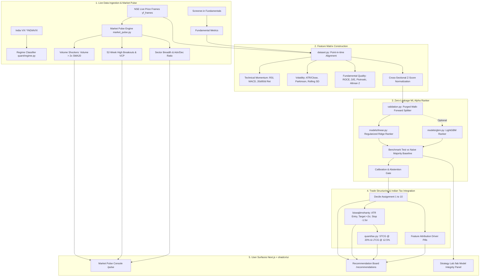

# Unified Research: GitHub Stock Prediction Ecosystems, Quant ML Alpha & Live NSE Intelligence

This document unifies deep quantitative finance literature and institutional frameworks with real-world open-source GitHub repositories ([ChatGPT research survey](https://chatgpt.com/share/6aa0e93e-6608-83e8-93ef-bc43b3886b39)). It establishes what mathematically works, what fails, and how to build an institutional-grade **Market Pulse & Predictive Alpha Engine** tailored specifically for the Indian equity market (NSE/BSE) within **`stockportfolio.in`**.

---

## 1. Executive Summary: The Anatomy of Stock Prediction

Research across GitHub, academic publications (AAAI, NeurIPS, IJCAI), and hedge fund methodologies reveals three distinct tiers of systems:

```
┌─────────────────────────────────────────────────────────────────────────────┐
│ 1. The Naive Educational Tier (90% of GitHub Repos)                         │
│    • Approach: Predict P_{t+1} using LSTM/GRU on Close prices with MinMaxScaler│
│    • Illusion: R² > 0.95, visual plot overlap                               │
│    • Reality: 1-day lag persistence trap (P̂_{t+1} ≈ P_t); negative Sharpe.   │
│    • Fatal Flaws: Lookahead bias, serial autocorrelation, no friction.       │
├─────────────────────────────────────────────────────────────────────────────┤
│ 2. The Empirical Reality-Check Tier (e.g., StockIntel, StockFormer)         │
│    • Approach: Directional 3-class classification under purged walk-forward │
│    • Finding: Out-of-sample directional models fail to beat naive baselines.│
│    • Real Signal: Exists in cross-sectional ranking (ROC-AUC 0.52–0.59), but│
│      binary/ternary thresholding destroys it.                               │
│    • Innovation: Volatility-scaled bands (±0.5σ_h), abstention mechanism.  │
├─────────────────────────────────────────────────────────────────────────────┤
│ 3. The Institutional Quantitative Tier (Qlib, FinRL, mlfinlab, PKScreener) │
│    • Approach: Never predict raw price; frame as Cross-Sectional Alpha.     │
│    • Method: Rank universe stocks by forward excess return (Rank IC).       │
│    • Guardrails: Purged & Embargoed CV (López de Prado), Triple Barrier.    │
│    • Integration: Market Pulse, Volume Shockers, ATR targets, Indian Tax.   │
└─────────────────────────────────────────────────────────────────────────────┘
```

---

## 2. Comprehensive Taxonomy of GitHub Repositories Analyzed

### A. Institutional Quantitative Platforms & Factor Libraries
| Repository | Stars / Citations | Primary Architecture | Core Strength | Key Limitation |
|---|---|---|---|---|
| **[microsoft/qlib](https://github.com/microsoft/qlib)** | ~16k ⭐ | LightGBM, DoubleEnsemble, ALSTM, Transformer, GATs | Institutional-grade factor mining; Alpha158/360 libraries; cross-sectional rank loss; Rank IC evaluation | Heavy data pipeline; steep curve; default datasets geared towards US/China |
| **[AI4Finance-Foundation/FinRL](https://github.com/AI4Finance-Foundation/FinRL)** | ~11k ⭐ | Deep Reinforcement Learning (PPO, SAC, DDPG, TD3) | Dynamic multi-asset portfolio rebalancing and trade execution as Markov Decision Processes | Sensitive to hyperparameters; high sample complexity; regime overfitting |
| **[hudson-and-thames/mlfinlab](https://github.com/hudson-and-thames/mlfinlab)** | ~4.5k ⭐ | Triple Barrier, Purged K-Fold CV, Fractional Differentiation | Faithfully implements Marcos López de Prado's *Advances in Financial Machine Learning* | Computationally intensive; focuses on validation rather than turnkey models |
| **[MXGao-A/QuantStock](https://github.com/MXGao-A/QuantStock)** | Active (FinTSB) | Transformers, LSTMs, Mamba, GAT, LightGBM | End-to-end framework; Top-K portfolio selection; Sharpe/Sortino/drawdown backtester | Deep learning models require high-spec GPU infrastructure |

### B. Empirical Evidence & Reality-Check Implementations
| Repository | Focus | Primary Architecture | Core Strength | Key Limitation / Finding |
|---|---|---|---|---|
| **[zhaymn/StockIntel](https://github.com/zhaymn/StockIntel)** | US & Indian Equities | LightGBM, LSTM, Stacked Ensemble, FinBERT | Purged walk-forward validation; volatility-scaled bands ($\pm 0.5\sigma_h$); calibration gate | **Honestly reported negative result**: models fail to beat naive baseline out-of-sample for directional forecasting |
| **[digantk31/StockAI](https://github.com/digantk31/StockAI)** | Indian Equities | SARIMAX, LSTM, Random Forest, FinBERT | NIFTY 50 benchmark comparison; Markowitz efficient frontier; transaction costs | Relies on traditional regression without cross-sectional ranking loss |

### C. Live Indian Market Scanners & Recommendation Engines
| Repository | Target Universe | Core Strength | Practical Value for `stockportfolio.in` | Key Limitation |
|---|---|---|---|---|
| **[pkjmesra/PKScreener](https://github.com/pkjmesra/PKScreener)** | NSE Universe (Nifty 500) | 40+ live market scanners; volume shockers; 52W breakouts; VCP patterns | Proven NSE-specific technical screening primitives | CLI / Telegram only; no web UI; rule heuristics |
| **[bllubhai/stockbot-india](https://github.com/bllubhai/stockbot-india)** | Nifty 500 | Market Pulse + Deep Dive + Fundamentals + Buy/Hold/Sell ranking | Complete functional workflow and dashboard vision | **Not synced with live data feeds**; Streamlit prototype |
| **[deshwalmahesh/NSE-Stock-Scanner](https://github.com/deshwalmahesh/NSE-Stock-Scanner)** | NSE Equities & F&O | Breakout detection; sector analysis; option chain integration | Option chain & moving average integration patterns | Script-based; minimal statistical validation |
| **[biswajitmohanty/ind-stock-analysis](https://github.com/biswajitmohanty/ind-stock-analysis)** | Indian Stocks | India VIX regime conditioning; ATR-scaled entry, target, stop-loss | Volatility-conditioned risk brackets (ATR targets) | Rule-based scoring without walk-forward ML |
| **[bklieger-groq/stockbot-on-groq](https://github.com/bklieger-groq/stockbot-on-groq)** | Global / US | Groq Llama-3 70B inference; TradingView widgets; financial news | Modern interactive UI pattern with fast LLM summaries | Not adapted for Indian market or tax rules |

### D. Modern Time-Series Foundation Models & Financial LLMs
| Repository | Approach | Core Strength | Relevance for Production Containers |
|---|---|---|---|
| **[amazon-science/chronos-forecasting](https://github.com/amazon-science/chronos-forecasting)** | Pre-trained T5 transformer on tokenized continuous series | Zero-shot probabilistic forecasting with prediction intervals | Univariate only; misses balance sheet fundamentals; heavy checkpoint |
| **[shiyu-coder/Kronos](https://github.com/shiyu-coder/Kronos)** (AAAI 2026) | Autoregressive Transformer with K-line tokenizer | Pre-trained on 12B+ candlestick bars; understands OHLCV morphology | Experimental; high GPU memory footprint |
| **[AI4Finance-Foundation/FinGPT](https://github.com/AI4Finance-Foundation/FinGPT)** | LoRA / QLoRA fine-tuned open LLMs (LLaMA 3, Mistral) | Financial sentiment analysis, news event impact extraction | Excellent for news pipelines; requires GPU for local inference |
| **[AI4Finance-Foundation/FinRobot](https://github.com/AI4Finance-Foundation/FinRobot)** | Multi-agent Chain-of-Thought with deterministic math layer | Separates deterministic math (DCF, Greeks) from LLM narrative synthesis | Directly mirrors `stockportfolio.in`'s deterministic-first philosophy |

---

## 3. Methodological Breakthroughs & Mathematical Realities

### Reality 1: The Directional Prediction Trap vs. Cross-Sectional Alpha
* **The Trap**: Predicting whether a stock will be up or down tomorrow ($P(R_{t+1} > 0)$). In liquid markets, daily returns have near-zero autocorrelation ($\rho \approx 0$). As proven by `StockIntel`, even sophisticated LightGBM and LSTM ensembles achieve ROC-AUC of only 0.52–0.54 and fail to beat a naive majority baseline after trading friction.
* **The Solution (Cross-Sectional Factor Ranking)**: Ranking 50 stocks against each other cross-sectionally on date $t$ for forward $H$-day relative excess return:
  $$y_{i, t} = \text{Rank}\left(R_{i, t \to t+H} - R_{\text{benchmark}, t \to t+H}\right)$$
  Information Coefficient (Rank IC) measures the Spearman correlation between predicted rank and actual forward return. An institutional Rank IC of **0.04 to 0.08** reliably yields positive Sharpe ratios when traded as a Long Top-Decile / Underweight Bottom-Decile strategy.

### Reality 2: Volatility-Scaled Target Horizons (StockIntel Lesson)
Fixed percentage bands (e.g., $+3\%$ / $-2\%$) fail across varying regimes: during high-volatility regimes (India VIX > 20) normal noise hits $+3\%$ within hours, while during low-volatility regimes (India VIX < 12) a stock may take 60 days to move $2\%$.
* **Solution**: Target bands must scale dynamically with realized volatility:
  $$\text{Bullish Threshold} = +0.5 \times \sigma_{\text{realized}, H}, \quad \text{Bearish Threshold} = -0.5 \times \sigma_{\text{realized}, H}$$
  where $\sigma_{\text{realized}, H} = \text{ATR}_{14} \times \sqrt{H} / \text{Price}$.

### Reality 3: Leakage Eradication (Purged Walk-Forward CV)
Standard K-Fold cross-validation leaks information in financial time series due to:
1. **Serial autocorrelation** in momentum and volatility features.
2. **Label overlap**: If forward return is computed over $H = 10$ days, training on day $t$ uses price at $t+10$. Any test fold starting before $t+10$ contains leaked future information.
* **Solution**:
  - **Purging**: Remove training samples whose forward labeling window intersects with the test evaluation window.
  - **Embargoing**: Discard $E = 5$ trading days immediately following test windows to prevent autoregressive post-test leakage into later training windows.

### Reality 4: The Dominance of Tabular Regularized Models in Constrained Deployments
Across `qlib`, `StockIntel`, and quantitative literature:
- Deep neural networks (LSTM, Transformers) on tabular financial time series consistently underperform or barely match Gradient Boosted Decision Trees (LightGBM) and L2-regularized Ridge Rankers.
- Furthermore, neural networks require $100\times$ the compute, take tens of megabytes of weights, and lack native feature attribution.
- **For `stockportfolio.in`**: A pure `numpy`/`scipy` regularized factor ranker provides instantaneous execution with zero Docker bloat, with optional `lightgbm` auto-detection.

---

## 4. The Complete `stockportfolio.in` Synthesized Architecture

We combine the best elements of all surveyed systems into a clean, 5-stage pipeline:



---

## 5. Architectural Specifications for System Components

### 1. Market Pulse Module (`backend/app/market_pulse.py`)
- **Advances / Declines**: Real-time ratio of advancing vs. declining stocks across NIFTY 50 and NIFTY 500.
- **Volume Shockers** (from `PKScreener`):
  $$\text{Volume Surge Ratio} = \frac{\text{Volume}_t}{\text{SMA}_{20}(\text{Volume})} \ge 2.0 \quad \text{with } \text{Return}_t > 0$$
- **52-Week Breakout Radar**:
  $$\text{Within 52W High} = \frac{\text{Price}_t}{\text{Max}_{252}(\text{High})} \ge 0.98$$
- **Sector Breadth**: Aggregated 1-day change across Nifty Bank, IT, Auto, Pharma, FMCG, Metal, Energy.
- **India VIX Gauge**: Current VIX reading categorized into Low (<13), Moderate (13–18), or High (>18) volatility regimes.

### 2. ML Alpha Pipeline (`backend/app/ml/`)
- **`labeling.py`**:
  - $10$-day forward excess return relative to `^NSEI`.
  - Volatility-scaled ternary labels (`BULLISH`, `NEUTRAL`, `BEARISH`) using $\pm 0.5\sigma_h$.
  - Triple-barrier categorical outcomes.
- **`dataset.py`**:
  - Point-in-time tabular alignment ensuring no lookahead data.
  - Scale-free stationary features (price momentum ratios, normalized oscillator distances, ratios of fundamentals).
- **`validation.py`**:
  - Purged walk-forward CV generator with 5-day post-test embargo.
  - Performance evaluator: Spearman Rank IC, Pearson IC, Information Ratio (IC / $\sigma_{\text{IC}}$), and skill vs. naive equal-weight baseline.
- **`models/linear.py`**:
  - Fast, pure NumPy/SciPy L2-regularized rank loss optimizer.
  - Instantaneous training (<100ms) with full parameter transparency.
- **`models/gbm.py`**:
  - Optional LightGBM Ranker with graceful linear fallback.

### 3. Trade Structuring & Tax Engine
- **Trade Levels**:
  - `Entry`: Market execution price
  - `Target`: $\text{Price} + 2.0 \times \text{ATR}_{14}$
  - `Stop Loss`: $\text{Price} - 1.5 \times \text{ATR}_{14}$
  - `Risk/Reward`: Fixed mathematically at $1.33:1$ minimum.
- **Tax Line**: Evaluates held positions against Indian capital gains rules:
  - Held $< 365$ days: **STCG @ 20%**
  - Held $\ge 365$ days: **LTCG @ 12.5%** above annual ₹1.25L exemption.

### 4. User Interface Surfaces (`frontend/src/app/`)
- **`/pulse` (Market Pulse Console)**:
  - Header: Live India VIX badge + Market Regime banner + Advance/Decline ratio bar.
  - Sector Performance carousel/ribbon.
  - Interactive tables for Volume Shockers and Breakouts with 1-click drill-down to stock analysis.
- **`/recommendations` (AI Alpha Radar Tab)**:
  - Decile 10 "Strong Buy" ranked picks.
  - Trade execution card with Entry, Target, and Stop-Loss.
  - Evidence driver pills (`+Momentum 20d`, `+Volume Shock`, `+High ROCE`, `+Low D/E`).
  - Tax-aware exit line for existing holdings.
- **`/lab` (Model Evidence & Verification Panel)**:
  - Out-of-sample Rank IC curve.
  - Model vs. Naive Baseline comparison chart.
  - Honest abstention alert when out-of-sample skill is negative.
