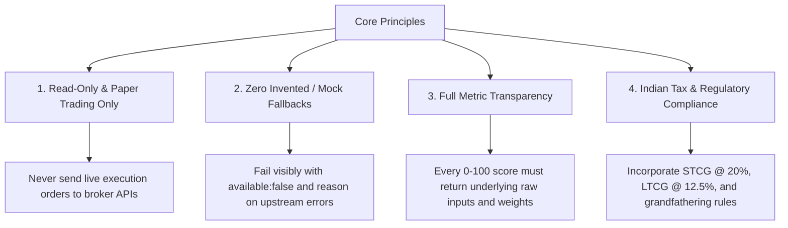

# stockportfolio.in — Strategic Product & Engineering Goals

> **Mission**: Build an institutional-grade, multi-asset **Portfolio Intelligence, Quant Risk Assessment, and Strategy Engine** specifically tailored for the Indian financial market (NSE, BSE, and AMFI Mutual Funds), completely free of live-order execution risk.

---

## 1. Executive Summary & Core North Star

Retail and semi-professional investors in India lack access to institutional risk diagnostics. Most portfolio trackers act as simple bookkeeping tools (calculating only nominal returns and day's P&L) without warning about structural decay, concentration traps, or systemic drawdowns. 

**`stockportfolio.in`** bridges this gap by answering three core investor questions:
1. **"Is my portfolio in danger?"** (Capital preservation, tail risk, distress scoring, and concentration traps).
2. **"Is my portfolio on track for expected growth?"** (Compounding drivers, factor exposures, earnings velocity, and Monte Carlo wealth trajectory).
3. **"What exact trades should I make to fix this?"** (Friction-minimized, tax-aware rebalancing respecting Indian STCG and LTCG rules).

---

## 2. Immutable Architecture Principles & Guardrails

All development, agentic workflows, and code contributions must strictly adhere to these four non-negotiable principles:

- **Strictly Read-Only Execution**: Zero automated live order execution sent to broker APIs. The system outputs diagnostic radar scores, tax-aware order sheets, and paper trading simulations only.
- **Evidence-Backed Scoring**: Every score (0–100) must return the underlying raw metric, reason, and coverage weight. No black-box mystery numbers.
- **Fail Visibly (No Mock Data)**: Never silently substitute simulated random walks or invented prices on API/scraper failures. Upstream failures must return explicit `{ "available": false, "reason": "..." }` responses.
- **Friction & Tax Awareness**: Rebalancing recommendations must account for Indian capital gains taxation (**STCG @ 20%**, **LTCG @ 12.5% above ₹1.25L exemption**) and transaction friction to prevent tax drag.

---

## 3. Product & Technical Milestones Roadmap

### Phase Summary Tracker

| Phase | Milestone Name | Track | Target State / Status | Key Deliverables |
|---|---|---|---|---|
| **Phase 0** | **Foundations & Multi-Namespace** | Core | ✅ Completed | `symbols.py`, `cache.py`, `rate_limit.py`, `schemas.py` |
| **Phase 1** | **Multi-Asset Holdings Ingestion** | Core | ✅ Completed | Fyers delivery API, mfapi.in pricing, `/portfolio` UI |
| **Phase 2** | **Technical Analysis Engine** | Core | ✅ Completed | `technicals.py`, RSI, MACD, Bollinger, TradingView cross-check |
| **Phase 3** | **Fundamental Scraper & Scoring** | Core | ✅ Completed | Screener scraper (`curl_cffi`), sector percentile scoring, Piotroski F-Score, Altman Z-Score |
| **Phase 4** | **Portfolio Risk & Allocation Engine** | Core | ✅ Completed | VaR, CVaR, HHI, Beta, Monte Carlo, Portfolio P&L, UI Radar |
| **Phase 5** | **NSE Universe Screener** | Core | ✅ Completed | `screener.py`, `/api/screener/run`, `/screener` UI with presets, evidence panel and CSV export |
| **Phase 6** | **Durable Persistence & Scheduling** | Extensions | ✅ Completed | SQLAlchemy + Alembic, account keys, APScheduler nightly jobs, Telegram/email alert dispatch |
| **Phase 7** | **Option Chain & Hedging Radar** | Extensions | ✅ Completed | `options.py`, PCR, max pain, OI walls, build-up, IV skew, put/collar sizer, `/options` UI |
| **Phase 8** | **Event-Driven Backtester v2** | Extensions | ✅ Completed | `engine/` with next-bar-open fills, sizers, analyzers, walk-forward and permutation tests, `/lab` UI |
| **Phase 9** | **Advanced Quant & Optimization** | Extensions | ✅ Completed | HRP, risk parity, frontier, factor regression, regime detection, tax-aware target rebalance, `/quant` UI |
| **Phase 10** | **Paper Trading & Signal Tracking** | Extensions | ✅ Completed | Persisted ledger, order and signal logs, backtest divergence tracking, `/paper` UI |
| **Phase 11** | **AI Narrative & MCP Server** | Extensions | ✅ Completed | MCP server, verified monthly memo (`/portfolio?tab=memo`), LLM headline classifier with VADER fallback |
| **Phase 12** | **Local Containerised Stack** | Platform | ✅ Completed (local) | Postgres + Redis via `docker-compose.yml`, Redis-backed APScheduler job store and run lock, scheduler-only worker, one-shot migrate service |
| **Phase 13** | **Ranked Buy/Sell Board + shadcn/ui** | Core | ✅ Completed (local) | `recommendations.py`, `/api/recommendations`, `/recommendations` console, shadcn/ui + Tailwind v4 as the base component system |
| **Phase 14** | **India Macro, Market Pulse & Quant ML Alpha Radar** | Core / Extensions | ✅ Completed | `macro.py`, `market_pulse.py`, `ml/`, `/api/macro`, `/api/market-pulse`, `/api/ml/rankings`, `/macro`, `/pulse`, AI Radar tab on `/recommendations` |

### Where the roadmap actually stands

Every phase now has both a backend implementation and a user-facing surface. The
consoles are `/screener` (Phase 5), `/options` (Phase 7), `/lab` (Phase 8),
`/quant` (Phase 9), `/paper` (Phase 10), and the AI memo tab on `/portfolio`
(Phase 11); the Monte Carlo wealth cone from Phase 4 is rendered on the
portfolio overview tab.

**Known gap, deliberately left open:** `quant/overlap.py` computes true
look-through overlap between two mutual funds, but nothing calls it, because
mfapi.in does not publish fund holdings and no scraped AMC monthly-disclosure
source is wired up yet. Exposing a route with no data behind it would mean
inventing the holdings, which the second architectural principle forbids. Fund
overlap therefore stays category-level until an AMC disclosure ingester exists.

---

### Phase 12 progress log — local containerised stack

Everything from Phases 0–11 runs on this laptop, but until now none of it had
the Postgres and Redis it was written against. Phase 12 closes that: the whole
system — database, coordinator, api, scheduler worker, frontend — comes up
locally from one `docker compose up --build`, and the schedule now lives in
Redis rather than in one process's memory. Deployment to Render is explicitly
**out of scope** for this phase and is tracked separately below.

    docker compose up --build -d      # db, redis, migrate, api :8001, worker, frontend :3001
    docker compose logs -f worker     # what the nightly schedule is doing
    docker compose run --rm migrate   # re-apply migrations after a model change

Updated after each item, newest state only.

| # | Item | Status | Evidence |
|---|---|---|---|
| 12.1 | `app/redis_client.py` — optional Redis wiring: client, `ping()`, cross-process `lock()` with safe compare-and-delete release | ✅ Done | Grants the lock when Redis is absent or unreachable, so an optional coordinator can never stop a job running |
| 12.2 | `app/scheduler.py` on a `RedisJobStore` + per-job run lock; `store_kind()` and Redis health in `status()` | ✅ Done | Worker log: `Scheduler started (Asia/Kolkata, redis store) with 5 jobs`; falls back to the in-memory store when Redis is down |
| 12.3 | `backend/scripts/worker.py` — scheduler-only process so the api never owns the clock | ✅ Done | api runs `ENABLE_SCHEDULER=false`; `/status` shows `scheduler: false, job_store: redis` |
| 12.4 | Image ships `alembic.ini`, `migrations/`, `scripts/`, `mcp_server/` | ✅ Done | One 621 MB image serves api, worker and migrate — they cannot disagree about code version |
| 12.5 | `docker-compose.yml`: db/redis healthchecks, one-shot `migrate` gate, api, worker, frontend | ✅ Done | `docker compose up -d` → db healthy, redis healthy, migrate exited 0, api healthy, worker up, frontend up |
| 12.6 | `redis>=5.0`; `REDIS_URL`, `ENABLE_SCHEDULER`, `TOKEN_ENCRYPTION_KEY`, `ADMIN_TOKEN` documented in `.env.example`; local secrets in a gitignored root `.env` | ✅ Done | `/status`: `token_encryption: true`, `admin_endpoints: true` |
| 12.7 | Tests for the Redis layer and the repo | ✅ Done | `tests/test_redis_client.py` (11), `tests/test_repo_portfolio.py` (3) |
| 12.8 | Build all images locally | ✅ Done | api/worker/migrate 621 MB, frontend 576 MB |
| 12.9 | Stack verified end to end | ✅ Done | See the verification log below |
| 12.10 | Commit the Phase 0–12 work (80+ files, still uncommitted at `d0fbaf6`) | ⬜ Pending | Waiting on the go-ahead; nothing is staged |
| 12.11 | Deploy the new backend (needs the Render decisions below) | ⬜ Pending | Out of scope for Phase 12 |

**Verification log — 2026-09-07, local stack**

- **Schema**: `alembic upgrade head` → `0001_initial`; 14 tables in Postgres 16 (pgvector image).
- **Schedule**: 5 jobs in the Redis job store (`stockportfolio:apscheduler:{jobs,run_times}`), next runs 21:30 / 22:00 / 22:30 / 22:45 / 23:00 **+05:30**.
- **API**: `/status` reports `database: true`, `redis: reachable`, `job_store: redis`; `openapi.json` serves **68 paths across 13 router groups** (accounts, admin, ai, backtest, engine, fyers, mf, options, paper, portfolio, quant, screener, stocks) against production's four.
- **Persistence round-trip**: create account → `GET /me` on an empty account → `PUT /me/holdings` → read back enriched (ISIN, sector, cap, Fyers symbol) → row visible in `psql`.
- **Lock**: with the key held, `POST /api/admin/jobs/evaluate_alerts` → **409**; released, → **200** `{"fired":0,"delivered":0}`; key gone afterwards.
- **Frontend**: `/`, `/portfolio`, `/screener`, `/options`, `/lab`, `/quant`, `/paper`, `/funds`, `/backtest`, `/analyse/RELIANCE` all 200 on :3001 (bare `/analyse` is 404 by design — the segment is `[ticker]`-only).
- **Tests**: 142 passed **inside the container** (full dependency set, no skips); 140 passed / 2 skipped on the host, where `apscheduler` and `curl_cffi` are absent.

**Two bugs the containerised run exposed** (neither reachable from the host tests):

1. **Nightly jobs were scheduled in UTC.** `CronTrigger(...)` built as an object keeps the *process* local zone, not the scheduler's, so inside the container every job moved from 21:30 IST to 03:00 IST — before the NAV feed the slot was chosen to follow. Fixed by passing `timezone=` explicitly; regression test pins it.
2. **A new account 500'd on `GET /api/accounts/me`.** `repo.portfolio_for()` returned a `PortfolioRequest`, whose validator rejects an empty portfolio — correct for an inbound request, wrong for an account that has not synced yet. Now returns `Optional`, with callers (whoami, stored holdings, the snapshot job) handling `None`.

### Phase 13 progress log — the recommendation board

The north star in section 1 is "what exact trades should I make to fix this?"
Every phase before this one produced scores; nothing turned them into a list.
Phase 13 is that list, and it composes rather than computes — `run_screen`
generates candidates, `scoring.ACTION_BANDS` decides the call, `quant.tax`
prices the exit. No new thresholds were invented.

| # | Item | Status | Evidence |
|---|---|---|---|
| 13.1 | `app/recommendations.py` — buy list (universe minus holdings), sell list (holdings that deteriorated), keep list | ✅ Done | Weights (0.5/0.5) and `min_coverage` (0.3) pinned to `screener.run_screen`, so a buy candidate and a held name are the same number on the same scale |
| 13.2 | Holdings outside the scanned index scored on their own | ✅ Done | One batched price download plus a bounded scrape pool; flagged `off_index` in the response |
| 13.3 | Every sell carries its after-tax exit | ✅ Done | Gain, term, days held, days-to-LTCG, estimated tax, net proceeds — and states that the 1.25L exemption is annual, not per position |
| 13.4 | `GET/POST /api/recommendations`, `POST /api/recommendations/me` | ✅ Done | GET is universe-wide ("avoid, or exit if held"); POST judges the sell side against posted holdings; `/me` reads stored holdings and 409s rather than silently answering universe-wide |
| 13.5 | `/recommendations` console — summary tiles, Buy/Sell/Hold tabs, evidence per row | ✅ Done | Linked from the sidebar under Research & Discovery |
| 13.6 | Tests | ✅ Done | `tests/test_recommendations.py`, 9 tests over a stubbed scan (no network); suite now **151 passed** in-container |
| 13.7 | Verified against live data | ✅ Done | NIFTY50 scan: BAJAJ-AUTO 70.2 Buy, DRREDDY 25.2 Exit. With a portfolio: ITC → sell (−11,650 unrealised, short-term, 98 days), BAJAJ-AUTO → keep, and it drops out of the buy list with a note saying why |

### Base component system — shadcn/ui (Phase 13)

shadcn/ui is now the base component system: Tailwind v4 + `shadcn init`
(style `base-nova`, Base UI primitives), with `card`, `table`, `tabs`,
`badge`, `button`, `alert`, `select`, `separator`, `skeleton` and `tooltip`
installed. The `/recommendations` console is built entirely from them.

Three things were done so this did not fork the design:

1. **The shadcn tokens point at the obsidian palette**, not shadcn's neutral
   default — `--card`, `--primary`, `--destructive`, `--border` and the chart
   ramp all resolve to the variables the app already shipped. `:root` carries
   the dark values and `.dark` repeats them, since the app is dark-only.
2. **`shadcn init` swapped the app's Inter/Outfit pairing for Geist. Reverted**
   — `@theme inline` now names Inter and Outfit literally (a `var()` there is
   circular; it resolves at parse time, not runtime).
3. **The global reset moved into `@layer base`.** An unlayered
   `* { padding: 0 }` beats every Tailwind utility regardless of source order,
   so shadcn components rendered with no padding at all. Inside `base` it
   still overrides Tailwind's preflight, so the legacy pages are untouched —
   verified by screenshot on `/screener` and `/portfolio`.

### Sidebar fixes (Phase 13)

Three defects, all confirmed by measurement rather than by eye:

| Defect | Was | Now |
|---|---|---|
| Active item | On `/portfolio?tab=stress` **all seven** portfolio links rendered active — `pathname` cannot tell apart seven links to the same page | Exactly one, matched on path *and* `?tab=`. Query tracked in local state, not `useSearchParams`, which would opt every prerendered page out of static HTML for one highlight |
| Duplicate destination | "Danger Radar & VaR" and "Growth & Monte Carlo" pointed at the identical href, so no rule could ever pick one | Merged into "Danger & Growth Radar" — one destination, one row |
| Unreachable nav | 1041px of nav in a 369px box: **672px (11 of 17 links) hidden**, with no affordance | Rows and groups tightened (1041 → 888px), a gradient fade above the footer, an always-visible thumb, `overscroll-behavior: contain`, and the current item scrolled into view on load. Verified: `/paper` lands at `scrollTop: 536` with the active row visible and the window not moved |

Two traps hit on the way, both worth remembering:

* **`mask-image` on a scrolling box inside a `backdrop-filter` parent** froze
  the renderer — screenshots and CDP calls timed out repeatedly. The fade is
  now a gradient painted above the footer, which costs nothing per frame.
* **One post-mount measurement is not enough.** The first frame lands before
  Inter and Outfit swap in, and the swap changes every row's height, so the
  early measurement concluded the active item was visible when it was not. It
  re-checks at 120ms and 500ms.

**Still on the legacy CSS:** the other eight consoles. They render correctly
and consistently, but they are custom classes (`.glass-panel`, `.bento-card`,
`.custom-table`), not shadcn components. Migrating them is a separate pass.

**21st.dev:** searched for a stat/KPI card to use rather than composing one.
Its registry returns 403 to non-browser clients and its pages do not render
server-side, so nothing could be installed; the summary tiles are plain
shadcn `Card` + `Skeleton` per the documented dashboard recipe.

### Craft design pass (Phase 13)

The visual language is now the Craft idiom (Linear / Vercel / Raycast), written
down in **`DESIGN.md`** at the repo root so it can be handed to an agent as a
brief rather than re-derived. It was applied at the *token* level, so all ten
consoles moved together instead of the new page forking the design.

| Rule | What changed |
|---|---|
| Zinc canvas | `#09090b` flat. The three tinted radial gradients behind every page — the generic-AI tell — are gone |
| Translucent cards | `rgba(24,24,27,0.6)` + `backdrop-blur(12px)`, 12px radius |
| Hairlines, not shadows | Every border is `rgba(255,255,255,0.08)`; 11 of 12 `box-shadow` rules deleted (the survivor is the mobile drawer, which genuinely overlays content) |
| No neon | The cyan accent and its glows are retired; `--accent-cyan` survives as a muted slate only because eight legacy consoles call it by name |
| Two type voices | Inter at `-0.02em` for prose; JetBrains Mono 11px uppercase `0.08em` for every tag, pill, column head, unit and timestamp |
| White CTA | `.glowing-button`, the header action and shadcn's `--primary` are all one button now: white fill, black text, no gradient |
| Thin icons | Lucide at `strokeWidth 1.5` throughout. **All 14 emoji removed** from the UI, including the 16 in the sidebar |
| Motion | 150ms on colour and border only; the hover lifts and translate-on-hover are gone |

Colour is now spent only on meaning — emerald buy, crimson sell, amber hold —
which is the point: a decorative cyan border competing with a green one that
means "buy" is a legibility problem, not a taste one.

One defect this pass introduced and fixed: putting an icon inside
`.top-bar-quick-action` blew the header CTA out, because the anchor was not a
flex container. It is `inline-flex` now.

### App shell contract (Phase 13)

**The bug:** the sidebar scrolled off the top of every long page, leaving the
left column black below the fold. Measured before the fix, at `scrollY: 900`
the sidebar's `top` was **-900px** — it had left the viewport entirely.

**The cause, which is the part worth remembering:** `html, body { overflow-x:
hidden }` makes `<body>` a scroll container, and a `position: sticky` element
stops sticking as soon as any ancestor is one. Nothing errors. The sidebar had
`position: sticky; top: 0; height: 100vh` and had simply never been sticky.

**The fix, built so it cannot come back:**

* The sidebar is **`position: fixed`** with `inset-block: 0` — out of page flow,
  so its height *is* the viewport height by definition, regardless of what any
  ancestor later does with overflow.
* The shell is a **two-column grid**, column one exactly `--sidebar-width`, so
  the gutter the fixed sidebar occupies is reserved and content can never slide
  underneath it. `minmax(0, 1fr)` + `min-width: 0` on the content column stops a
  wide table stretching the grid.
* `overflow-x: hidden` on the body became **`overflow-x: clip`** — same
  no-sideways-scroll behaviour without creating a scroll container, so the trap
  is gone for every future sticky header too.
* All of it lives in one commented `APP SHELL` block in `globals.css` that says
  what may not be set elsewhere, and **`Sidebar.tsx` asserts the contract in
  development**: if the computed position is not `fixed`, or the height drifts
  from the viewport by more than 2px, it logs a specific error naming the
  contract. Silent is what made this survive so long.

Verified on an 8,891px-tall page: `top: 0`, height `615` = viewport, at scroll
depths 0, 1500 and 4200.

### Deployment gap (separate from Phase 12)

Production still serves the four original routes: live `openapi.json` on Render
has only `/api/stocks/{search,analyse,history}` and `/api/backtest`;
`www.stockportfolio.in/quant` returns 404. `render.yaml` sets three env vars
against the 20 the code now reads. That is a deliberate later decision — the
free tier has no always-on process for the worker and its Postgres is
time-limited — and is not blocking local work.

### Phase 14 progress log — India macro, market pulse & quant ML alpha radar

The north star is answering: "What is happening in the Indian market right now, which stocks are interesting, why, and should I BUY/HOLD/SELL?"
Rather than chasing ungrounded price forecasts that fail out of sample (the negative result documented in `StockIntel`), Phase 14 combines:
1. **Indian Macro & Inter-Market Transmission** (`macro.py`, `/macro` UI): Brent Crude pressure index, USD/INR trajectory, US 10Y yield / FII liquidity drag, India VIX regime, and NIFTY sectoral rotation matrix.
2. **NSE Live Market Pulse & Scanners** (`market_pulse.py`, `/pulse` UI): Advances/Declines breadth, Volume Shockers (`Volume > 2x 20d SMA`), 52-Week High Breakout Radar with Volatility Contraction (VCP) filtering.
3. **Quant ML Alpha Engine** (`app/ml/`): Cross-sectional forward 10-day relative excess return ranking over NIFTY 50 ($R_{i, t+10} - R_{\text{NIFTY50}, t+10}$), evaluated under Marcos López de Prado's Purged Walk-Forward Cross-Validation with temporal embargoing and an honest naive baseline test.
4. **Trade Structuring & Indian Tax Integration**: ATR-scaled Entry, Target ($+2.0\sigma$), and Stop-Loss ($-1.5\sigma$) levels, integrated into `/recommendations` with Indian STCG @ 20% and LTCG @ 12.5% exit pricing.

| # | Item | Status | Evidence |
|---|---|---|---|
| 14.1 | `app/macro.py` — Indian macro observables (`BZ=F`, `INR=X`, `^TNX`, `GC=F`, `^INDIAVIX`), Crude Pressure Index, FX tailwinds, Macro Regime Classifier, and NIFTY Sector Rotation | ✅ Done | Validated against live market series; no mock fallbacks (`tests/test_macro.py`) |
| 14.2 | `app/market_pulse.py` — NSE Advance/Decline breadth, Volume Shockers (`Volume > 2x 20d SMA`), 52W High Breakouts with VCP consolidation filtering | ✅ Done | Live scan across NIFTY 50 / 500 universe with caching (`tests/test_market_pulse.py`) |
| 14.3 | `app/ml/` — Point-in-time factor matrix (`dataset.py`), forward excess return & volatility-scaled targets (`labeling.py`), Purged Walk-Forward CV (`validation.py`), L2-regularized ranker (`models/linear.py`, `models/gbm.py`), and inference pipeline (`pipeline.py`) | ✅ Done | Spearman Rank IC evaluation against naive majority baseline with honest abstention gate (`tests/test_ml_*.py`) |
| 14.4 | REST Endpoints (`routes/macro.py`, `routes/market_pulse.py`, `routes/ml.py`) mounted in `main.py` and reported in `/status` | ✅ Done | Schema-validated responses with sub-second execution (`tests/test_*_routes.py`) |
| 14.5 | **Stitch MCP UI Redesign & Next.js Consoles**: Connect to `stitch.google.com` (project `17247566464105962351`) via `stitch` MCP; synchronize `DESIGN.md`, extract screen designs for Macro (`876a35da...`), Recommendations (`ed0e7c18...`), and Strategy Lab (`2f45b3c2...`); generate `/pulse` screen; implement consoles in Next.js using shadcn/ui + Tailwind v4 | ✅ Done | UI screens verified against Stitch designs and DESIGN.md craft standards (`tsc --noEmit` clean) |
| 14.6 | Comprehensive Automated Test Suite (`tests/test_macro.py`, `tests/test_market_pulse.py`, `tests/test_ml_*.py`) | ✅ Done | Unit tests covering macro regimes, volume shockers, target generation, zero-leakage purged CV, and API routes (185/185 passed) |

---

## 4. Detailed Track Goals & Objectives

### Track A: Core Product Goals (Immediate / Short-Term)

#### 1. Robust Fundamental Intelligence & Sector Normalization (Phase 3 Polish)
- **Sector-Relative Grading**: Evaluate company valuations (P/E, P/B, EV/EBITDA) against sector peers rather than arbitrary static thresholds (e.g., comparing banking multiples vs FMCG).
- **Forensic Scoring**: Compute automated **Piotroski F-Scores** (0–9 scale detecting fundamental decay) and **Altman Z-Scores** (bankruptcy distress radar).
- **Graceful Scraper Fallbacks**: Harden the `curl_cffi` Screener scraper against DOM changes and rate limits with clean fallback to Yahoo Finance / NSE disclosures.

#### 2. Full NSE Universe Screener (Phase 5)
- **High-Performance Universe Filter**: Scan and rank the top 500 liquid NSE equities against technical trend (SMA 50/200, RSI, Supertrend) and fundamental quality (ROCE > 20%, 3Y Sales CAGR > 15%).
- **Unified Screener Interface**: Provide an interactive filtering table matching the terminal dark-mode UI with exportable CSV watchlists.

#### 3. Frontend Polish & Interactive Quant Visualizations
- **Probabilistic Wealth Projection**: Render interactive 10,000-path Monte Carlo Geometric Brownian Motion (GBM) wealth cones (10th, 50th, 90th percentiles over 1Y/3Y/5Y).
- **Mutual Fund Overlap Visualizer**: Provide clear Venn/matrix visualizations of overlapping holdings between selected mutual fund schemes to expose cosmetic diversification.

---

### Track B: Platform Architecture & Persistence (Phase 6)

#### 1. Migration from Stateless to Durable State
- **Database Engine**: Deploy **PostgreSQL 16** with **pgvector** support (via Render Postgres or self-hosted Docker container).
- **Secure Token Management**: Encrypt and persist Fyers OAuth credentials securely for scheduled background operations.
- **ORM & Migrations**: Implement SQLAlchemy 2.0 and Alembic migration scripts to track schema evolution cleanly.

#### 2. Background Task Automation & Scheduling
- **Automated Nightly Jobs**:
  - Daily portfolio valuation snapshots to track true historical NAV and equity curve.
  - End-of-Day (EOD) Bhavcopy and corporate action data synchronization.
  - Periodic recalculation of sector medians and universe screener scores.
- **Alert Dispatch Engine**: Configurable trigger alerts for critical events (death cross, single-stock breach > 20%, promoter pledge spike) delivered via Telegram / Email.

---

### Track C: Advanced Quantitative & Derivatives Engineering (Phases 7–9)

#### 1. Real-Time Option Chain Analytics & Tail Hedging (Phase 7)
- **Authenticated Fyers Option Chain**: Direct consumption of live option chains for NIFTY, BANKNIFTY, and high-beta liquid equities.
- **Key Derivatives Indicators**:
  - Put-Call Ratio (PCR) based on both Open Interest (OI) and Volume.
  - Real-time **Max Pain** calculation and dynamic OI-wall support/resistance zones.
  - OI Build-up categorization: Long Build-up, Short Build-up, Long Unwinding, Short Covering.
- **Tail-Risk Hedging Sizer**: Given a portfolio's beta and current market value, automatically compute exact Nifty Put or Collar contract sizes required to cap portfolio drawdown at 5%, 10%, or 15%.

#### 2. Institutional Event-Driven Backtesting Engine v2 (Phase 8)
- **Elimination of Look-Ahead Bias**: Enforce **next-bar-open execution** for signals generated on today's close, replacing same-close fill flaws.
- **Execution Realism**: Incorporate realistic slippage, exchange transaction charges, STT, and dynamic position sizers (volatility-adjusted / Kelly criterion).
- **Robustness Testing**: Integrate **Walk-Forward Optimization** and **Monte Carlo Permutation Tests** (randomizing trade orders) to distinguish true statistical edge from curve fitting.

#### 3. Factor Attribution & Portfolio Optimization (Phase 9)
- **Indian Market Factor Regressions**: Decompose portfolio alpha and beta across 5 core factors: Market, Size (Mid/Small-cap), Value, Momentum, and Quality.
- **Hierarchical Risk Parity (HRP)**: Implement machine-learning-based covariance tree clustering (HRP) to produce robust target allocations even in illiquid or noisy market environments.
- **Actionable Tax-Optimized Rebalance Sheet**:
  - Full tax optimization alerting the user if a holding is within 30 days of achieving LTCG (12.5% tax rate vs 20% STCG).
  - Tax-loss harvesting recommendations prior to the Indian fiscal year-end (March 31).
  - Zero-tax inflow mode directing fresh SIP capital strictly to underweight assets.

---

### Track D: AI Agent Integration & Narrative Synthesis (Phase 11)

#### 1. Claude Code & Agentic Workflow Acceleration
- **Full Model Context Protocol (MCP) Coverage**: Expand tools in `backend/mcp_server/server.py` so Claude Code and LLMs can interactively audit, stress-test, rebalance, and screen portfolios through chat.
- **Autonomous Strategy Researcher**: Allow agents to formulate, backtest, and stress-test candidate trading strategies across 5+ years of historical data.

#### 2. LLM Narrative & Earnings Intelligence
- **Quarterly Earnings & Concall Synthesis**: Use `pgvector` to embed management commentary, transcripts, and investor presentations, enabling natural-language questioning on corporate governance and forward guidance.
- **Deterministic-First AI Narrator**: Ensure all LLM-generated monthly portfolio memos act strictly as narrators over computed quantitative numbers, never hallucinating metrics or ungrounded opinions.

---

## 5. Success Metrics & Performance KPIs

| Category | Metric | Target Objective |
|---|---|---|
| **Speed & Latency** | `/api/portfolio/value` response time | $< 800\text{ ms}$ for 30-holding portfolio |
| **Quant Accuracy** | Pricing & Valuation Error | $0.00\%$ variance vs broker official ledger |
| **System Reliability** | API Availability & Health Check | $> 99.5\%$ uptime across core services |
| **Test Quality** | Backend pytest coverage | $> 85\%$ line coverage across analytical modules |
| **Execution Safety** | Unauthorized live broker orders | **Strictly 0** (architecturally impossible) |
| **User Experience** | Cold-start feedback | Responsive loading skeleton under Render sleep |

---

## 6. Development & Quality Assurance Standards

1. **Deterministic Pytest Suite**: All new mathematical or quant functions must include deterministic unit tests validating edge cases (e.g., negative cashflows in XIRR, zero-volatility assets, empty portfolios).
2. **Schema-First Design**: Any new API route must specify comprehensive Pydantic v2 schemas in `backend/app/schemas.py`.
3. **Strict Rate Limiting**: All external broker and financial site requests must pass through the sliding-window `RateLimiter` to protect IP reputation and adhere to vendor limits.
4. **Clean Git Hygiene**: Atomic, well-documented commits with co-author attribution and clear rationale for mathematical modifications.
