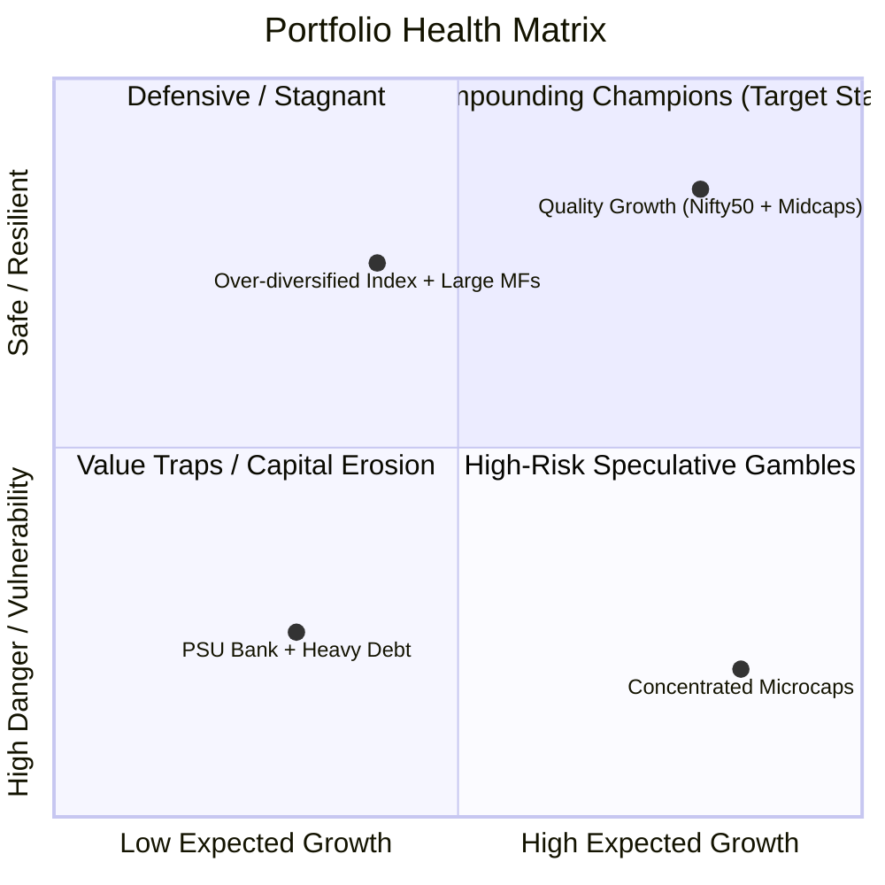
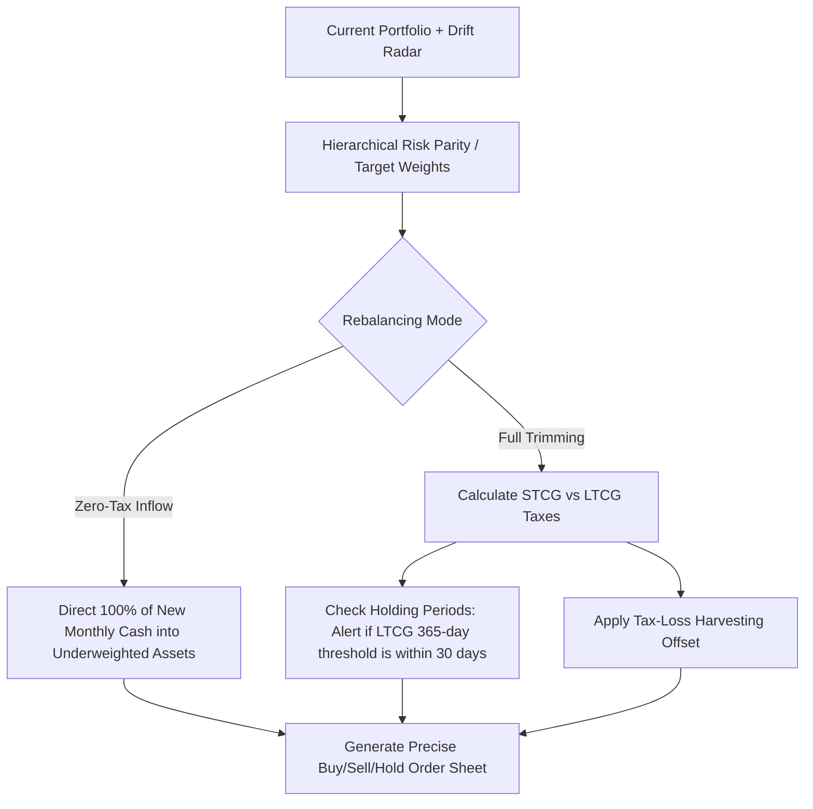

# stockportfolio.in — Master LLM & Architecture Reference

> **Single Source of Truth for AI Assistants, LLM Agents (Claude Code / Cursor / Codex), and Engineers.**  
> *Last Updated: 2026* | *Repository: `stockportfolio_in`*

---

## 1. System Overview & Core Philosophy

**`stockportfolio.in`** is an institutional-grade, multi-asset **Portfolio Intelligence, Quant Risk Assessment, and Strategy Engine** tailored specifically for the Indian market (NSE, BSE, and AMFI Mutual Funds).

### Core Value Proposition
The platform continuously evaluates an investor's portfolio across two independent 0–100 indices:
1. **"Is my portfolio in danger?"** (Capital preservation, systemic shock vulnerability, concentration traps, fundamental decay, technical breakdowns).
2. **"Is my portfolio on track for expected growth?"** (Compounding engine, factor exposures, earnings acceleration, sector tailwinds, probabilistic CAGR trajectory).
3. **"What exact trades should I make to fix this?"** (Tax-aware, friction-minimized portfolio rebalancing).



### Immutable Architectural Principles
- **Read-Only & Paper Trading Only**: Strictly **zero live order execution** sent to broker APIs. Signals, paper simulation, and rebalance order sheets only.
- **Evidence-Backed Scoring**: Every score (0–100) must return the underlying raw metric, reason, and coverage weight. No black-box mystery numbers.
- **No Invented / Mock Fallbacks**: Code must fail visibly with `{"available": false, "reason": "..."}` rather than substituting simulated random walks or mock prices.
- **Tax & Friction Awareness**: Rebalancing recommendations respect Indian capital gains taxation (**STCG @ 20%**, **LTCG @ 12.5% above ₹1.25L exemption**) and transaction friction.

---

## 2. Hosting & Deployment Topology (Split Hosting: Vercel + Render)

The production architecture separates the Edge frontend from the heavy scientific Python backend.

```
Browser
   │
   ├──────────────► Vercel (Next.js 16 App Router, React 19, TypeScript)
   │                Root Directory: frontend/
   │                Env: NEXT_PUBLIC_API_URL
   │
   └── fetch() ───► Render Web Service (Docker Container, Python 3.12, Uvicorn)
                    Port: $PORT (injected at runtime, bound to 0.0.0.0:$PORT)
                    Region: Singapore
                    Env: FRONTEND_ORIGIN, NLTK_DATA, ENV=production
                             │
                             ├──► Fyers API (OAuth2, Live Quotes, Holdings, Candles)
                             ├──► mfapi.in (Indian MF NAV database & historical series)
                             ├──► Screener.in (curl_cffi TLS impersonation scraper)
                             └──► Google News RSS & Exchange Announcements (curl_cffi)
```

### A. Frontend on Vercel
- **Root Directory**: Must be explicitly configured to `frontend/` in the Vercel dashboard.
- **Runtime & Build**: Next.js 16.2.9, Node 20+, `pnpm install` via `pnpm-lock.yaml`.
- **Environment Inlining**: `NEXT_PUBLIC_API_URL` is inlined into client JS at build time. `src/lib/api.ts` enforces a build-time validation that throws an explicit error if missing or invalid.

### B. Backend on Render (Docker Web Service)
- **Configuration**: Defined in root `render.yaml` with `rootDir: backend` and `dockerfilePath: ./Dockerfile`.
- **Container Build (`backend/Dockerfile`)**:
  - Python 3.12-slim base image.
  - Pre-downloads the NLTK `vader_lexicon` at image build time to `/usr/local/share/nltk_data` (avoids per-request or cold-start downloads).
  - Starts uvicorn bound to `0.0.0.0:$PORT`.
- **Health Check Probe**: `/health` returning `{"status": "ok"}`.
- **Cold Starts**: Render free tier sleeps after ~15 minutes of inactivity (first wake takes ~30–50s).

### C. CORS & Origin Resolution
- **Production**: Driven by comma-separated `FRONTEND_ORIGIN` (e.g. `https://www.stockportfolio.in,https://stockportfolio.in`).
- **Preview Deployments**: Scoped via `PREVIEW_ORIGIN_REGEX` to match project-specific Vercel preview URLs without trusting all wildcard domains.
- **Local Dev**: Regex matching dynamic loopback ports (`http://localhost:\d+`, `http://127.0.0.1:\d+`).
- **Security**: `allow_credentials=False` (no cookies/passwords shared across origins).

---

## 3. Self-Hosted Multi-Container Docker Architecture (`docker-compose.yml`)

For private self-hosting or full background cron worker execution, the platform runs as a coordinated multi-container stack:

```yaml
version: "3.8"

services:
  frontend:
    build:
      context: ./frontend
      dockerfile: Dockerfile
    ports:
      - "3000:3000"
    environment:
      - NEXT_PUBLIC_API_URL=http://localhost:8001
    depends_on:
      - api

  api:
    build:
      context: ./backend
      dockerfile: Dockerfile
    ports:
      - "8001:8001"
    environment:
      - ENV=development
      - PORT=8001
      - DATABASE_URL=postgresql://postgres:postgres@db:5432/stockportfolio
      - REDIS_URL=redis://redis:6379/0
      - FRONTEND_ORIGIN=http://localhost:3000
    depends_on:
      - db
      - redis

  worker:
    build:
      context: ./backend
      dockerfile: Dockerfile
    command: python -m app.worker
    environment:
      - DATABASE_URL=postgresql://postgres:postgres@db:5432/stockportfolio
      - REDIS_URL=redis://redis:6379/0
    depends_on:
      - db
      - redis

  db:
    image: pgvector/pgvector:pg16
    ports:
      - "5432:5432"
    environment:
      - POSTGRES_DB=stockportfolio
      - POSTGRES_USER=postgres
      - POSTGRES_PASSWORD=postgres
    volumes:
      - postgres_data:/var/lib/postgresql/data

  redis:
    image: redis:7-alpine
    ports:
      - "6379:6379"
    volumes:
      - redis_data:/data

volumes:
  postgres_data:
  redis_data:
```

---

## 4. Repository Structure & Directory Layout

```
stockportfolio_in/
├── backend/
│   ├── app/
│   │   ├── main.py              # FastAPI app initialization, CORS, routers, /health
│   │   ├── symbols.py           # Canonical symbol registry (NSE, Fyers, yf, Screener)
│   │   ├── schemas.py           # Pydantic v2 schemas (Holdings, Candles, PortfolioRequest)
│   │   ├── scoring.py           # Core recommender primitives (Signal, ScoreCard, blends)
│   │   ├── portfolio.py         # Multi-asset portfolio valuation & allocation engine
│   │   ├── analysis.py          # Stock technical calculations (RSI, MA) & sentiment
│   │   ├── mf_analysis.py       # Mutual fund quant analytics (CAGR, XIRR, Rolling, Ratios)
│   │   ├── backtester.py        # Single-symbol strategy backtesting simulator
│   │   ├── fyers_client.py      # Rate-limited Fyers API v2/v3 client
│   │   ├── mfapi_client.py      # Client for mfapi.in with TTL caching
│   │   ├── scraper.py           # Google News scraper via curl_cffi Chrome impersonation
│   │   ├── cache.py             # Thread-safe in-process TTLCache with eviction
│   │   ├── rate_limit.py        # Sliding-window multi-tier rate limiter (10/s, 200/m, 10k/d)
│   │   ├── dotenv_lite.py       # Safe lightweight .env reader/writer
│   │   ├── data/
│   │   │   └── nse_symbols.json # Master NSE symbol database (ISIN, Fyers, Sector, Cap)
│   │   └── routes/
│   │       ├── stocks.py        # /api/stocks/search, /api/stocks/{ticker}
│   │       ├── portfolio.py     # POST /api/portfolio/value
│   │       ├── mutual_funds.py  # /api/mf/search, /api/mf/{scheme_code}/*
│   │       ├── fyers.py         # /api/fyers/login, /callback, /holdings, /quotes
│   │       └── backtest.py      # POST /api/backtest
│   ├── scripts/
│   │   └── refresh_symbols.py   # Refreshes nse_symbols.json from NSE equity & F&O masters
│   ├── tests/
│   │   ├── test_cache.py        # Unit tests for TTLCache
│   │   ├── test_rate_limit.py   # Unit tests for sliding-window RateLimiter
│   │   ├── test_scoring.py      # Unit tests for scoring, signals, blending, and ranking
│   │   └── test_symbols.py      # Unit tests for symbol canonicalization and lookup
│   ├── Dockerfile               # Production container image
│   ├── pyproject.toml           # uv-managed dependencies (+ dev group)
│   ├── uv.lock                  # uv lockfile (resolved versions & hashes)
│   └── pytest.ini               # Pytest configuration
├── frontend/
│   ├── src/
│   │   ├── app/
│   │   │   ├── page.tsx                 # Home / search landing dashboard
│   │   │   ├── layout.tsx               # Root layout & navigation header
│   │   │   ├── globals.css              # Glassmorphic CSS design system & CSS variables
│   │   │   ├── analyse/[ticker]/        # Deep-dive stock technical & news analysis
│   │   │   ├── backtest/                # Interactive strategy backtester UI
│   │   │   ├── funds/                   # Mutual fund search & explorer
│   │   │   │   └── [schemeCode]/        # Fund NAV chart, rolling returns, SIP simulator
│   │   │   └── portfolio/               # Unified Portfolio Dashboard
│   │   │       ├── page.tsx             # Main dashboard container
│   │   │       ├── PortfolioDashboard.tsx # Holdings table, totals, P&L, warnings
│   │   │       ├── AllocationBars.tsx   # Asset class, sector, & cap distribution charts
│   │   │       └── AddHoldingForm.tsx   # Manual Stock & Mutual Fund entry modal
│   │   └── lib/
│   │       ├── api.ts                   # Base API URL helper with build-time assertion
│   │       ├── portfolioApi.ts          # Portfolio API client, token & localStorage storage
│   │       └── mfApi.ts                 # Mutual Fund API client
│   ├── package.json                     # Next.js 16, React 19, Chart.js dependencies
│   └── next.config.ts                   # Next.js build configuration
├── docs/
│   ├── DEPLOYMENT_PRD.md                # Split-hosting deployment specification
│   └── PORTFOLIO_ANALYSIS_PRD.md        # Comprehensive 11-phase quant & feature PRD
├── download_historical.py               # CLI tool to download historical CSVs via yfinance
├── render.yaml                          # Render Blueprint infrastructure-as-code
└── llm.md                               # This master documentation file
```

---

## 5. Symbol Identity & Multi-Namespace Resolution (`symbols.py`)

A critical challenge in Indian fintech is reconciling five competing namespaces for a single security:

| Namespace | Example Format | Usage Area |
|---|---|---|
| **NSE Trading Symbol (Canonical)** | `RELIANCE` | Internal key across the entire application |
| **Fyers Symbol** | `NSE:RELIANCE-EQ` | Broker live quotes, holdings, historical candles |
| **yfinance Ticker** | `RELIANCE.NS` | Delayed quotes fallback, historical price series |
| **Screener.in URL** | `/company/RELIANCE/` | Scraped quarterly financials and ratio blocks |
| **TradingView Ticker** | `NSE:RELIANCE` | Technical oscillator & moving average consensus |
| **ISIN** | `INE002A01018` | Official exchange filings, CAS statements, depository matching |

### Benchmark Mapping by Market Cap
Stocks are graded against their specific market-cap peer index to eliminate size bias:
- **Large Cap** $\rightarrow$ `NIFTY50` (`NSE:NIFTY50-INDEX`)
- **Mid Cap** $\rightarrow$ `NIFTYMIDCAP100` (`NSE:NIFTYMIDCAP100-INDEX`)
- **Small / Micro Cap** $\rightarrow$ `NIFTYSMLCAP100` (`NSE:NIFTYSMLCAP100-INDEX`)
- **Default / Broad** $\rightarrow$ `NIFTY500`

---

## 6. The Danger Matrix vs. Expected Growth Engine

### A. The Danger Matrix (Capital Preservation & Tail Risk)
Evaluates if a portfolio is vulnerable to severe drawdowns, structural breakdowns, or liquidity traps:

1. **Concentration & Single-Point-of-Failure**:
   - Single Stock $> 20\%$ of portfolio value $\rightarrow$ **High Danger Flag**.
   - Single Sector $> 35\%$ allocation $\rightarrow$ **Sector Overexposure Flag**.
   - Herfindahl-Hirschman Index (HHI) $> 2500$ $\rightarrow$ **Concentration Trap**.
2. **Tail Risk & Downside Volatility**:
   - Parametric & Historical Value at Risk (**VaR 95%**, 1-month window).
   - Conditional VaR (**CVaR / Expected Shortfall**).
   - Portfolio Beta $> 1.35$ vs Nifty 500 $\rightarrow$ **High Volatility Alert**.
   - Historical Crisis Replays (Simulating March 2020 COVID, 2008 GFC, 2018 Midcap Meltdown).
3. **Forensic & Fundamental Red Flags**:
   - **Piotroski F-Score $\le 3$** (out of 9) $\rightarrow$ Deteriorating financial health.
   - **Altman Z-Score $< 1.8$** $\rightarrow$ Bankruptcy distress zone.
   - **Promoter Pledging $> 20\%$** or persistent promoter selling.
   - **Interest Coverage Ratio $< 2.0\text{x}$** combined with rising Debt-to-Equity.
4. **Technical Breakdown Triggers**:
   - Price closing below **200-day EMA** on $> 1.5\text{x}$ average volume.
   - **Death Cross**: 50 EMA crossing below 200 EMA.
   - 3-Month Relative Strength (RS) lagging Nifty 500 by $> 15\%$.
5. **False Diversification (Mutual Fund Overlap)**:
   - Evaluates underlying holding overlap between multiple funds. Two funds sharing $> 60\%$ identical stocks trigger an overlap warning.

---

### B. The Expected Growth Engine (Compounding Accelerators)
Evaluates multi-year wealth accumulation potential:

1. **Capital Efficiency**:
   - Return on Capital Employed (**ROCE 3Y/5Y Average $> 20\%$**).
   - Return on Equity (**ROE $> 18\%$**).
   - Cash Flow from Operations to EBITDA ratio (**CFO / EBITDA $> 80\%$**).
2. **Growth Velocity**:
   - 3-Year & 5-Year **Sales / Revenue CAGR $> 15\%$**.
   - 3-Year & 5-Year **PAT (Net Profit) CAGR $> 20\%$**.
   - Positive QoQ and YoY operating margin expansion.
3. **Valuation Runway & PEG**:
   - Price-to-Earnings Growth (**PEG $< 1.5$** — Growth at Reasonable Price).
   - P/E ratio not expanding beyond $1.5\text{x}$ of 5-year historical median without fundamental acceleration.
4. **Probabilistic Trajectory (Monte Carlo Simulation)**:
   - 10,000-path Geometric Brownian Motion (GBM) simulation computing 10th, 50th, and 90th percentile wealth cones over 1Y, 3Y, and 5Y horizons.

---

## 7. Tax-Aware Portfolio Rebalancing Engine

The Rebalancing Engine transforms diagnosis into an exact, actionable order sheet:



### Indian Taxation Intelligence Rules
1. **Short-Term Capital Gains (STCG)**: Taxed at **20%** for equity held $< 12\text{ months}$.
2. **Long-Term Capital Gains (LTCG)**: Taxed at **12.5%** for equity held $\ge 12\text{ months}$, with an annual **₹1.25 Lakh exemption**.
3. **Holding Period Optimization**: If a deteriorating stock is at Day 345, the engine calculates whether holding for 20 more days to qualify for LTCG saves more tax than the expected price risk.
4. **Tax-Loss Harvesting**: Identifies unrealized losses before March 31st to offset taxable realized gains.
5. **Zero-Tax Inflow Mode**: When adding fresh capital (e.g. ₹25,000 SIP), the engine channels 100% of new capital to underweighted assets without selling winning positions, incurring ₹0 in tax.

---

## 8. Free Cron-Driven News & Catalysts Intelligence

### 100% Free Data Ingestion (Zero Paid API Keys)
- **Google News RSS**: `https://news.google.com/rss/search?q={TICKER}+NSE+stock` fetched via `curl_cffi`.
- **BSE / NSE Corporate Announcements**: Statutory filings, board meeting outcomes, order wins.
- **Financial Media RSS**: Moneycontrol, LiveMint, Economic Times.

### Automated Taxonomy & Impact Tagging (Default: T-1 / Yesterday's News)
The background cron job pulls disclosures from the **previous 24–48 hours** and tags them:

| Tag | Triggers & Keywords | Impact Rating |
|---|---|---|
| 🏷️ **`Earnings & Results`** | PAT, Revenue, Margin, EBITDA, Guidance | 🟢 Bullish / 🔴 Bearish |
| 🏷️ **`Governance & Legal`** | Auditor resignation, SEBI notice, IT raid, Litigation | 🔴 **CRITICAL DANGER** |
| 🏷️ **`Promoter / Insider`** | Pledge increased, Promoter selling, Insider trade | 🔴 **HIGH DANGER** |
| 🏷️ **`Order Wins & Expansion`** | Contract awarded, Capacity expansion, USFDA approval | 🟢 Bullish Catalyst |
| 🏷️ **`Corporate Action`** | Dividend, Bonus issue, Stock split, Buyback | ⚪ Neutral / Informational |
| 🏷️ **`Macro & Policy`** | RBI repo rate, PLI scheme, Duty changes, Crude oil | ⚪ Sector Impact |

**Portfolio-Specific Filter**: Scans only the stocks in the user's active portfolio and top holdings of their mutual funds, eliminating 99% of general market noise.

---

## 9. Model Context Protocol (MCP) Server for Claude Code

The platform exposes its analytical engines directly as tools callable by Claude Code, Cursor, and Claude Desktop via `backend/mcp_server/`.

### Registering with Claude Code
```bash
claude mcp add stockportfolio -- python backend/mcp_server/server.py
```

### Exposed MCP Tools
- **`get_portfolio()`**: Retrieves live holdings, total valuation, P&L, and asset/sector allocations.
- **`get_danger_growth_radar()`**: Returns the 0–100 Danger Score, 0–100 Growth Score, and specific red flags.
- **`analyse_holding(symbol: str)`**: Deep-dive technical indicators, Piotroski score, Altman Z, and recent concall summaries for a symbol.
- **`rebalance_portfolio(cash: float, mode: str)`**: Computes optimal tax-aware rebalancing buy/sell lists.
- **`option_chain_hedging(symbol: str, target_drawdown: float)`**: Sizing Nifty Puts/Collar contracts to hedge portfolio drawdown.
- **`screen_stocks(filters: dict)`**: Scans the NSE 500 universe based on technical/fundamental filters.
- **`get_portfolio_news_catalysts(window: str)`**: Returns tagged catalysts for the portfolio from yesterday's news.

---

## 10. Data Persistence & Authentication Model

### A. Stateless Storage (Phases 0–5)
- **Fyers OAuth Token**:
  - Returned from `/api/fyers/callback` via URL fragment (`/portfolio#fyers_token=...`).
  - Frontend extracts and stores token in **`sessionStorage`** (scoped to the tab, cleared on close).
  - Sent to backend via `X-Fyers-Token` header.
- **Holdings Storage**:
  - Saved in browser **`localStorage`** under versioned key `stockportfolio.holdings.v1`.
  - Backend endpoints (`/api/portfolio/value`) are pure stateless functions of the posted request body.

### B. Durable State (Phase 6+ Docker / SaaS)
- **PostgreSQL 16**: User accounts, encrypted Fyers tokens, historical daily portfolio valuation snapshots, rebalance audit logs.
- **`pgvector` Extension**: Vector embeddings of corporate concalls and quarterly earnings filings for semantic retrieval.
- **Redis 7**: Sliding-window rate-limiting counters and Celery task queues.

---

## 11. Complete API Route Reference

### Stocks & Screening (`/api/stocks`)
- `GET /api/stocks/search?q={query}`: Autocomplete search matching symbol or company name.
- `GET /api/stocks/{ticker}`: Technical indicators, moving averages, sentiment score, and recent headlines.

### Portfolio Intelligence (`/api/portfolio`)
- `POST /api/portfolio/value`: Prices multi-asset holdings (Fyers $\rightarrow$ yfinance $\rightarrow$ mfapi), computes P&L and allocation mix.
- `POST /api/portfolio/analyse`: Comprehensive Danger Score, Growth Score, VaR, Piotroski breakdown, and warnings.
- `POST /api/portfolio/rebalance`: Computes tax-aware target weights and specific buy/sell order lists.

### Fyers Connectivity (`/api/fyers`)
- `GET /api/fyers/login`: Generates Fyers OAuth authorization redirect URL.
- `GET /api/fyers/callback`: Exchanges auth code for access token and redirects to frontend with fragment.
- `GET /api/fyers/status`: Validates token status against Fyers profile API.
- `GET /api/fyers/holdings`: Returns live delivery holdings enriched with NSE symbol metadata.
- `GET /api/fyers/positions`: Returns intraday and F&O open positions.
- `GET /api/fyers/funds`: Returns available margin and cash balances.
- `GET /api/fyers/quote?symbols=NSE:SBIN-EQ,...`: Real-time batched quotes (max 50 symbols).
- `GET /api/fyers/history?symbol=...&resolution=1D&range_from=...&range_to=...`: Historical OHLCV candles.

### Mutual Funds (`/api/mf`)
- `GET /api/mf/search?q={query}&direct_only=true&growth_only=true`: Searches AMFI schemes.
- `GET /api/mf/{scheme_code}`: Scheme metadata and latest NAV.
- `GET /api/mf/{scheme_code}/metrics`: Trailing returns, rolling returns, Sharpe, Sortino, volatility, max drawdown.
- `GET /api/mf/{scheme_code}/sip?monthly_amount=5000&start_date=...`: Historical SIP simulation.

### Backtesting (`/api/backtest`)
- `POST /api/backtest`: Executes historical strategy backtests (RSI, SMA Crossover, Hybrid) against Buy & Hold benchmark with fee modeling. Kept as the Phase-2 engine; new work uses `/api/engine`.

### Universe Screener (`/api/screener`)
- `GET /api/screener/filters`: The filter vocabulary — indices, sectors, caps, action bands — for populating the UI controls.
- `GET /api/screener/run`: Scores and ranks the universe on the same technical + fundamental model holdings use. `universe_limit` and `fundamental_limit` decide whether a run takes five seconds or five minutes; whole runs are cached for an hour and answer `cached: true`.

### Backtesting Engine v2 (`/api/engine`)
- `GET /api/engine/strategies`: Strategy catalogue with defaults and tunable parameter ranges.
- `POST /api/engine/run`: One backtest with **next-bar-open fills**, slippage, brokerage and STT. Optionally runs a permutation test in the same call.
- `POST /api/engine/walk-forward`: Optimise in-sample, measure out-of-sample, fold by fold. The only performance figure in the system never fitted to the data it is measured on.
- `POST /api/engine/permutation-test`: Runs a backtest, then shuffles its returns to ask whether the ordering carried information.

### Options & Hedging (`/api/options`)
- `GET /api/options/{symbol}/chain`: The normalised chain plus the expiry list. Requires a live Fyers token.
- `GET /api/options/{symbol}/analysis`: PCR (OI and volume), max pain, OI walls, build-up classification, IV skew.
- `GET /api/options/greeks`: Black-Scholes price and Greeks for one contract. No token needed.
- `POST /api/options/hedge`: Sizes the index put or collar that caps a portfolio drawdown at a chosen level, beta-weighted, with the basis-risk and rounding caveats in the response.
- `POST /api/options/payoff`: Expiry payoff curve for an arbitrary multi-leg position.

### Quant (`/api/quant`)
- `GET /api/quant/methods`: The allocators and the trade-off each makes.
- `POST /api/quant/optimise`: Target weights (HRP, risk parity, min variance, max Sharpe) with risk contributions, drift against current weights and an optional efficient frontier.
- `POST /api/quant/rebalance`: Tax-aware order sheet moving the portfolio toward target weights.
- `POST /api/quant/factors`: Factor exposure regression with return attribution and rolling betas.
- `POST /api/quant/regime`: Market regime classification with hysteresis, optionally including the portfolio's own cross-holding correlation.
- **Distinctive failure**: not enough overlapping history answers **422** naming the coverage report, not a generic 500.

### Accounts & Persistence (`/api/accounts`)
- `POST /api/accounts`: Creates an account; the `access_key` is shown exactly once and only its hash is stored.
- `GET /api/accounts/me`, `PUT|GET /api/accounts/me/holdings`, `POST /api/accounts/me/broker-token`, `GET /api/accounts/me/snapshots`.
- `GET|POST|DELETE /api/accounts/me/alerts/rules`, `GET /api/accounts/me/alerts/events`.
- All answer **503** with a reason when `DATABASE_URL` is unset, rather than 500ing on a missing engine.

### Paper Trading (`/api/paper`)
- `GET|POST /api/paper`: List and open simulated ledgers. Every response carries the read-only banner.
- `GET /api/paper/{id}`: Valuation, open positions and divergence from the backtest that justified the deployment.
- `GET /api/paper/{id}/orders`, `GET /api/paper/{id}/signals`: The audit trail, including signals that were *skipped*.
- `POST /api/paper/{id}/orders`: Record a manual simulated fill. `POST /api/paper/{id}/run`: evaluate the bound strategy over a watchlist.
- Requires both a database and an account key. **No route here can reach a broker order API.**

### AI Layer (`/api/ai`)
- `GET /api/ai/status`: Whether the narrative layer is configured, and what degrades when it is not.
- `POST /api/ai/report`: The monthly memo, written over computed metrics and verified — every figure in the prose is checked against the data the model was given, and unverified ones are returned in `unsupported_figures`.
- `POST /api/ai/sentiment`: LLM headline classification with a VADER fallback per headline.
- `POST /api/ai/explain`: Plain-English gloss on one holding's computed scorecard.

### Admin (`/api/admin`)
- `GET /api/admin/jobs`, `POST /api/admin/jobs/{name}`, `GET /api/admin/scheduler`: Inspect and trigger the nightly jobs. Gated on `X-Admin-Token`.

---

## 12. Frontend Architecture & Design System

### Next.js 16 App Router Structure

| Route | What it is | Notes |
|---|---|---|
| `/` | Landing page with search and the capability bento grid | Links into every console below |
| `/portfolio` | Holdings, valuation, Danger vs Growth radar | Tabs: overview (with the Monte Carlo wealth cone), crash simulator, tax rebalancer, holdings news, **AI memo** |
| `/screener` | NSE universe screener | Presets, evidence panel per row, CSV export |
| `/quant` | Quant lab | Target allocation, factor exposure, market regime, rebalance order sheet |
| `/options` | Option chain and hedging radar | Needs a live Fyers token; chain, PCR/max pain/OI walls/build-up, hedge sizer |
| `/lab` | Strategy lab (engine v2) | Next-bar-open backtests, permutation test, walk-forward |
| `/backtest` | The original Phase-2 backtester | Kept working, unchanged |
| `/paper` | Paper trading ledger | Needs a database and an account key; positions, order log, signal log, divergence |
| `/analyse/[ticker]` | Single-stock deep dive | |
| `/funds`, `/funds/[schemeCode]` | Mutual fund explorer | |

- **API clients**: one module per domain under `frontend/src/lib/` (`portfolioApi`, `screenerApi`, `optionsApi`, `quantApi`, `paperApi`, `engineApi`, `aiApi`), all sharing `http.ts` for the `X-Fyers-Token` / `X-Account-Key` headers and the FastAPI `detail` error contract.
- **Global Theme**: Dark-first quantitative terminal aesthetic defined in `frontend/src/app/globals.css`.
- **CSS Design Vocabulary**:
  - `.glass-panel`: Translucent card surface with subtle border and backdrop blur.
  - `.metric-card`: Structured KPI display with value, label, and trend color coding.
  - `.custom-table`: Dense tabular layout for financial holdings.
  - Colors: `--color-buy` (`#22c55e`), `--color-sell` (`#ef4444`), `--accent-cyan` (`#22d3ee`), `--bg-primary` (`#0b0f14`).
- **Chart.js Integration**:
  - Registered globally in client components with dark grid lines (`rgba(255, 255, 255, 0.08)`) and custom tooltip formatters.

---

## 13. Development Workflows & Testing

### Running the Full Stack Locally
Backend dependencies and the virtualenv are managed by [uv](https://docs.astral.sh/uv/)
(`backend/pyproject.toml` + `backend/uv.lock`), not pip/`requirements.txt`.
```bash
# 1. Backend (Terminal 1)
cd backend
uv sync                      # creates .venv and installs deps (incl. dev group)
uv run python -m app.main    # Starts FastAPI on http://127.0.0.1:8001
# Or activate the venv directly instead of prefixing every command with `uv run`:
#   PowerShell: .venv\Scripts\Activate.ps1
#   cmd:        .venv\Scripts\activate.bat
#   Git Bash:   source .venv/Scripts/activate
#   macOS/Linux: source .venv/bin/activate

# 2. Frontend (Terminal 2)
cd frontend
pnpm install
pnpm dev  # Starts Next.js on http://localhost:3000
```

### Running Unit Tests
```bash
cd backend
uv run pytest -v
```

### Refreshing the NSE Symbol Master Database
```bash
cd backend
python -m scripts.refresh_symbols
```

---

## 14. Strict Engineering Rules for LLM Coding Assistants

1. **Next.js 16 App Router Compliance**:
   - Client components MUST include `'use client';` at the very top.
   - Do NOT import Node built-ins inside client components.
   - Respect React 19 async request and layout patterns.
2. **Never Fabricate Financial Numbers**:
   - If an API or scraper fails, return `None` or `available: false` with an explicit reason. Never invent mock prices, NAVs, or returns.
3. **Symbol Translation Integrity**:
   - Always use `backend/app/symbols.py` functions (`to_fyers`, `to_yfinance`, `canonical`, `lookup`). Do not hardcode manual string replacements across components.
4. **Fyers Rate Limiting Discipline**:
   - Always respect the `RateLimiter` token bucket in `backend/app/rate_limit.py`. Never loop unthrottled over symbol lists.
5. **Type Safety & Pydantic v2**:
   - All backend request/response payloads must be strictly modeled in `backend/app/schemas.py`.
   - Use Pydantic v2 syntax (`@field_validator`, `@model_validator(mode="after")`).
