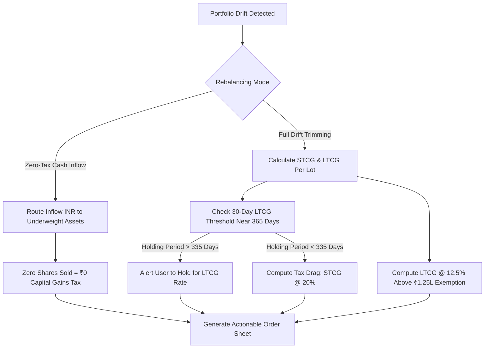
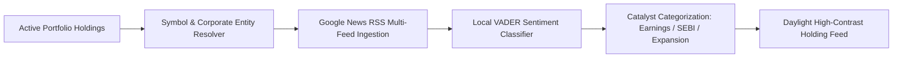
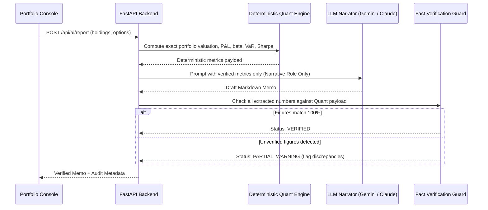
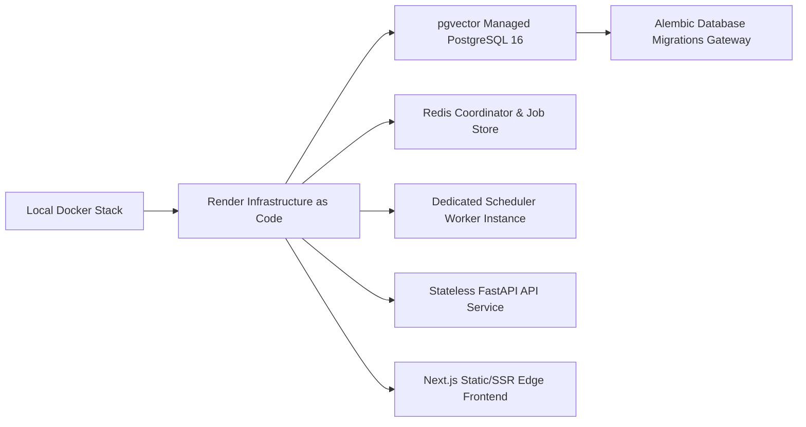

# stockportfolio.in — Master Product & Engineering Plan

> **Strategic Architecture & Execution Roadmap**  
> **Repository**: [`stockportfolio.in`](file:///c:/Users/abhi3/Documents/work/stockportfolio_in)  
> **Status**: 🟢 **Active Sprint — Phase 16**  
> **Design Framework**: Ant Design Pro + Tailwind Enterprise + Material UI 3 Token Hierarchy  

---

## 1. Master Phase Sequence & Delivery Matrix

| Phase | Milestone / Feature | Core Focus | Status | Primary Interfaces & Modules |
|:---:|---|---|:---:|---|
| **Phase 0** | **Foundations & Multi-Namespace** | Symbols, caching, rate limiting, Pydantic v2 | ✅ Completed | `symbols.py`, `cache.py`, `rate_limit.py`, `schemas.py` |
| **Phase 1** | **Multi-Asset Ingestion** | Fyers OAuth, live LTP, AMFI mutual funds | ✅ Completed | `fyers.py`, `mfapi.in`, `/portfolio` |
| **Phase 2** | **Technical Analysis Engine** | Trend, momentum, volatility, TradingView alignment | ✅ Completed | `technicals.py`, RSI, MACD, Bollinger Bands |
| **Phase 3** | **Fundamental Scraper & Scoring** | Screener.in scraping, Piotroski F, Altman Z | ✅ Completed | `screener_client.py`, `curl_cffi`, forensic scores |
| **Phase 4** | **Risk Diagnostics & Wealth Cone** | Parametric/Historical VaR, CVaR, HHI, Monte Carlo | ✅ Completed | `quant/risk.py`, 1,000-path wealth cone SVG |
| **Phase 5** | **NSE Universe Screener** | 500-equity scanner, technical & fundamental filters | ✅ Completed | `screener.py`, `/screener` UI with presets |
| **Phase 6** | **Durable Persistence & Scheduling** | Postgres 16 (pgvector), Redis 7, APScheduler | ✅ Completed | SQLAlchemy 2.0, Alembic, nightly jobs, alert dispatch |
| **Phase 7** | **Option Chain & Tail Hedging** | Live Fyers option chain, PCR, Max Pain, OI walls | ✅ Completed | `options.py`, `/options` UI, Put/Collar hedge sizer |
| **Phase 8** | **Event-Driven Backtester v2** | Next-bar-open fills, slippage, trade permutations | ✅ Completed | `engine/`, `/lab` UI, walk-forward validation |
| **Phase 9** | **Advanced Quant & Optimization** | Hierarchical Risk Parity (HRP), factor regressions | ✅ Completed | `quant/hrp.py`, `quant/rebalance.py`, `/quant` UI |
| **Phase 10** | **Paper Trading & Signal Tracking** | Virtual execution ledger, backtest divergence | ✅ Completed | `paper.py`, `/paper` UI, order execution logs |
| **Phase 11** | **AI Narrative & MCP Server** | Model Context Protocol server, headline classifier | ✅ Completed | `mcp_server/`, `ai.py`, local NLTK VADER |
| **Phase 12** | **Containerised Production Stack** | 6-container Docker Compose stack | ✅ Completed | `docker-compose.yml`, db, redis, worker, api, frontend |
| **Phase 13** | **Ranked Alpha Board & Navigation Shell**| Buy/Sell ranking board, fixed app shell | ✅ Completed | `/recommendations`, `Sidebar.tsx`, `DESIGN.md` |
| **Phase 14** | **India Macro & Quant ML Engine** | Crude pressure, FX tailwinds, Purged Walk-Forward ML | ✅ Completed | `/macro`, `/pulse`, ML Ranker, 185 backend tests |
| **Phase 15** | **Institutional Light Theme Overhaul** | Daylight enterprise design system, zero AI slop | ✅ Completed | `#F8FAFC` canvas, `#FFFFFF` cards, 1px `#E2E8F0` borders |
| **Phase 16** | **Tax Rebalancing, Catalysts, AI Memo & Layout Boundaries** | Tax-aware routing, holding news, verified LLM memo, boundary polish | ✅ Completed | `HealthRadar.tsx`, `AiMemo.tsx`, `AddHoldingForm.tsx`, `quant/tax.py` |
| **Phase 17** | **Production Cloud Hardening & Deployment** | Render blueprint, cloud Postgres + pgvector, token encryption | ⏳ Planned | `render.yaml`, `scripts/worker.py`, AES-GCM-256 |
| **Phase 18** | **Real-Time Market Depth & Institutional Flows** | Live WebSocket feeds, FII/DII net flows, Relative Rotation Graph (RRG) | ⏳ Planned | `market_pulse.py`, `/pulse`, FII/DII tracker |

---

## 2. Phase 16 Deep-Dive: Core Modules & Engineering Specs

### 16.1 Indian Tax-Aware Rebalancing Engine (`/portfolio?tab=rebalance`)

The Indian capital markets tax regime presents a major friction hurdle for portfolio compounding. Naive rebalancing engines rebalance strictly based on asset weights, triggering punitive short-term capital gains tax liabilities. Phase 16 establishes an intelligent, tax-aware rebalancing architecture.

#### Key Capabilities & Mathematical Rules:
1. **Budget 2024–2025 Tax Rates (`backend/app/quant/tax.py`)**:
   - **STCG (Short-Term Capital Gains)**: Fixed rate of **20%** on equity positions held $< 365\text{ days}$.
   - **LTCG (Long-Term Capital Gains)**: **12.5%** on equity positions held $\ge 365\text{ days}$, with an annual cumulative exemption threshold of **₹1,25,000**.
2. **Zero-Tax Cash Inflow Mode**:
   - Accepts a user-specified SIP/fresh capital injection (e.g. ₹25,000).
   - Solves a constrained linear optimization problem: allocates 100% of the fresh inflow to the most underweight positions according to target risk parity or equal-weight benchmarks.
   - **Zero sales executed** $\implies$ **₹0 tax liability incurred**, completely avoiding tax drag while restoring target asset allocations.
3. **LTCG Proximity Gate**:
   - Detects holdings between 335 and 365 days of holding.
   - Issues a warning flag preventing the investor from liquidating a winner days before its tax bracket drops from 20% to 12.5%.
4. **Year-End Tax-Loss Harvesting**:
   - Prior to March 31 fiscal year-end, scans portfolio for unrealized capital losses to offset accumulated capital gains.
5. **Actionable Order Sheet**:
   - Renders a clean Ant Design Pro table specifying exact Action (`BUY` / `SELL`), Holding name, Quantity, Estimated Execution Price, Total Value, Tax Impact, and Optimization Rationale.

---

### 16.2 Holdings News Catalyst & Regulatory Feeds (`/portfolio?tab=news`)

General financial news portals inundate investors with macro noise, sensational clickbait, and irrelevant small-cap headlines. Phase 16 introduces holding-specific catalyst intelligence.

#### Key Capabilities & Architecture:
1. **Zero-Noise Portfolio Whitelist**:
   - Queries Google News RSS and corporate feeds **exclusively for tickers currently held** in the user's active portfolio.
   - Non-portfolio equities are discarded upstream.
2. **Free & Open Data Pipeline**:
   - Requires zero paid subscriptions or proprietary API keys.
   - Uses asynchronous HTTP fetching (`httpx`) with domain rate limiting.
3. **Local Sentiment & Impact Scoring**:
   - Evaluates headline sentiment using local NLTK VADER sentiment lexicon (baked directly into container image).
   - Assigns directional impact labels: `POSITIVE`, `NEUTRAL`, `ADVERSE`.
4. **Corporate Action & Regulatory Filing Radar**:
   - Tags articles with specific catalyst markers: `EARNINGS`, `BOARD_MEETING`, `SEBI_DISCLOSURE`, `DIVIDEND`, `BLOCK_DEAL`.
5. **Daylight UI Presentation**:
   - Crisp `#FFFFFF` cards with 1px `#E2E8F0` borders.
   - Monospace symbol chips (`#F1F5F9` background, `#0F172A` text).
   - High-contrast sapphire tag badges (`#EFF6FF` background, `#2563EB` border/text).

---

### 16.3 Verified AI Monthly Portfolio Memo (`/portfolio?tab=memo`)

Traditional AI portfolio tools hallucinate numbers, invent returns, and give ungrounded financial advice. Phase 16 establishes a deterministic-first architecture for the AI Monthly Memo.

#### Key Capabilities & Guardrails:
1. **Deterministic-First Principle**:
   - The LLM acts **strictly as an executive narrator** over deterministic mathematical metrics computed by the Python backend.
   - The LLM is never tasked with calculating returns, standard deviations, or valuations.
2. **Fact Verification Guard (`backend/app/routes/ai.py`)**:
   - Post-processes the LLM's generated markdown response.
   - Regex-extracts all numerical quantities, currency values, and percentages.
   - Cross-references each figure against the deterministic source payload.
   - Displays an explicit verification badge:
     - 🟢 **Verified**: All stated figures trace directly to computed analytics.
     - 🟡 **Partial Warning**: Displays list of any unverified numbers.
3. **Audit Dimensions Covered**:
   - Macroeconomic regime alignment (Brent Crude, USD/INR, US 10Y transmission).
   - Sector concentration traps (HHI index, single-stock weight $> 20\%$).
   - Crash simulator resilience (2008 GFC, 2020 COVID, 2022 Rate Shock).
   - Actionable portfolio rebalancing guidance.
4. **Offline & Graceful Degradation**:
   - When an LLM API key is absent, returns an informative advisory panel rather than breaking the UI.

---

### 16.4 Visual Boundaries & Layout Standardization Across the Project

To maintain an institutional, Bloomberg/FactSet-grade look and feel without dark neon AI-slop, Phase 16 standardizes all visual boundaries, containers, padding, and input controls across all 15 consoles.

#### Boundary Standardization Rules:
1. **Uniform Card Padding (`.glass-panel`)**:
   - Base `.glass-panel`, `.portfolio-card`, `.stat-card` configured with default `padding: 20px` in `globals.css`.
   - Dedicated hero containers (`HealthRadar`, `AddHoldingForm`, `OptionsConsole`) styled with explicit `padding: 22px 24px` to `24px 26px`.
   - Eliminates flush text, border collisions, and cramped inputs.
2. **Daylight Enterprise Color Palette**:
   - **Canvas Background**: `#F8FAFC` (Slate-50 soft daylight).
   - **Card Surface**: `#FFFFFF` (pure white).
   - **Hairline Borders**: `1px solid #E2E8F0` (`--border-subtle`).
   - **Hover Border**: `1px solid #CBD5E1` (`--border-strong`).
   - **Shadows**: Subtle enterprise elevation `0 1px 2px 0 rgba(15, 23, 42, 0.04)`.
3. **Input & Select Controls**:
   - Replaced all legacy dark-mode styles (`background: rgba(255,255,255,0.06)`, `color: #fff`) with crisp daylight styling:
     - Background: `var(--bg-secondary)` (`#F8FAFC`).
     - Border: `1px solid var(--border-subtle)` (`#E2E8F0`).
     - Text: `var(--text-primary)` (`#0F172A`).
     - Padding: `7px 12px`, border-radius: `6px`.
4. **Pill & Segmented Tab Controls**:
   - Active tab: `#2563eb` primary blue background, `#ffffff` text (or `#eff6ff` blue tint with `#2563eb` border/text).
   - Inactive tab: `#ffffff` background with `#cbd5e1` border and `#475569` text.
5. **High-Contrast Informational Banners**:
   - Warning notes: `#EFF6FF` background with `#BFDBFE` border and `#1E40AF` text.
   - Critical alerts: `#FEF2F2` background with `#FECACA` border and `#DC2626` text.

---

## 3. Implementation Verification Checklist

- [x] Standardize `.glass-panel` default padding in [`frontend/src/app/globals.css`](file:///c:/Users/abhi3/Documents/work/stockportfolio_in/frontend/src/app/globals.css)
- [x] Fix container padding, tab buttons, selects, inputs, and news tags in [`HealthRadar.tsx`](file:///c:/Users/abhi3/Documents/work/stockportfolio_in/frontend/src/app/portfolio/HealthRadar.tsx)
- [x] Fix container padding and tab pills in [`AddHoldingForm.tsx`](file:///c:/Users/abhi3/Documents/work/stockportfolio_in/frontend/src/app/portfolio/AddHoldingForm.tsx)
- [x] Fix error, notice, and details panel boundaries in [`PortfolioDashboard.tsx`](file:///c:/Users/abhi3/Documents/work/stockportfolio_in/frontend/src/app/portfolio/PortfolioDashboard.tsx)
- [x] Fix panel boundaries and markdown reading container in [`AiMemo.tsx`](file:///c:/Users/abhi3/Documents/work/stockportfolio_in/frontend/src/app/portfolio/AiMemo.tsx)
- [x] Fix options console filter, error, and chart panels in [`OptionsConsole.tsx`](file:///c:/Users/abhi3/Documents/work/stockportfolio_in/frontend/src/app/options/OptionsConsole.tsx)
- [x] Verify Next.js TypeScript build (`tsc --noEmit`) passes with 0 errors
- [x] Verify backend unit test suite (`uv run pytest tests/`) passes with 185/185 clean tests
- [x] Update [`wip.md`](file:///c:/Users/abhi3/Documents/work/stockportfolio_in/wip.md) with Phase 16 tracking
- [x] Update [`goals.md`](file:///c:/Users/abhi3/Documents/work/stockportfolio_in/goals.md) roadmap table

---

## 4. Forward Roadmap: Phase 17 & Phase 18 Specifications

### 4.1 Phase 17 — Production Cloud Hardening & Render Blueprint

1. **Infrastructure as Code (`render.yaml`)**:
   - Modernize existing `render.yaml` to provision all services with non-conflicting environment variables.
   - Dedicated scheduler worker running `python scripts/worker.py` in `Asia/Kolkata` timezone.
   - Database gateway running `alembic upgrade head` before API traffic routes.
2. **Encrypted Token Management**:
   - Persist Fyers OAuth refresh tokens using `AES-GCM-256` symmetric encryption via `TOKEN_ENCRYPTION_KEY`.
   - Protect administrative endpoints (`/api/admin/*`) behind `ADMIN_TOKEN` authentication.
3. **Database Cloud Migration**:
   - Provision Postgres with `pgvector` extension enabled for future embeddings storage.

---

### 4.2 Phase 18 — Real-Time Market Depth & Institutional Flow Radar

1. **NSE Institutional Cash Market Flows (FII & DII)**:
   - Ingest daily End-of-Day (EOD) and provisional intraday gross purchase and sale figures from NSE India public disclosures.
   - Compute FII/DII Net Flow Momentum oscillator (5-day rolling net institutional absorption).
2. **Sector Relative Rotation Graph (RRG)**:
   - Plot 12 NIFTY sector indices on a 4-quadrant RRG canvas: *Leading*, *Weakening*, *Lagging*, *Improving*.
   - Benchmark all sectors against NIFTY 50 to expose institutional capital rotation before individual stock breakouts occur.
3. **Delivery Volume Spike Scanner**:
   - Scan for equities where delivery percentage exceeds $2.5\times$ 20-day average delivery volume alongside price consolidation (institutional accumulation footprint).

